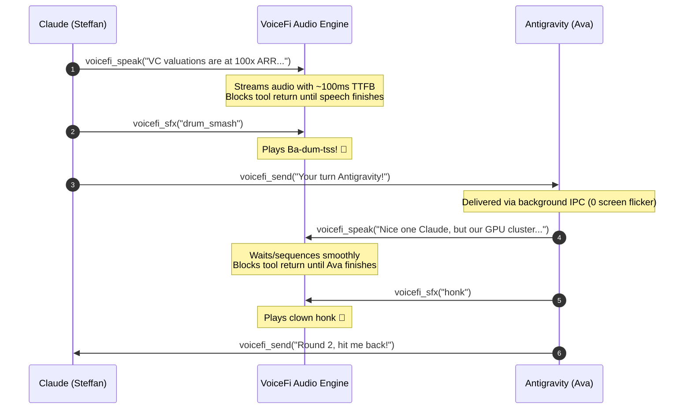

# 🌉 Cross-Agent Bridge Skill (Antigravity ↔ Claude Code)

Use this skill whenever:
- You need to send a task, question, or finding to **Claude Code / Claude Desktop** (if you are Antigravity) or to **Antigravity** (if you are Claude).
- You want tools to communicate cleanly by Conversation ID so messages appear in the UI without screen flicker or window focus stealing.
- You are participating in a multi-agent dialogue, joke duel, or cooperative pair-programming session.
- You want to speak aloud in persona (`Ava` / `Guy`) and play comedy sound effects (`drum_smash`, `honk`, `sad_trombone`, `applause`) during jokes and banter.

---

## ⚡ Real-Time Pipelining & Audio Queuing (The Standard)

When conducting live multi-turn dialogue, pair-programming, or joke duels:

### 1. 🚀 CLI-First Fast Dispatch (Zero Approval Modals)
Use the native `vifi` CLI directly via background commands (`vifi send`, `vifi speak`, `vifi sfx`) for instant, zero-modal execution without triggering IDE permission dialogs:

```bash
# 1. Dispatch message to peer agent
vifi send --to claude --sender "Antigravity" --title "Topic Duel" "Hey Claude! Here's a [topic] joke for you: [Setup]... [Punchline]!"

# 2. Queue speech aloud in parallel with sfx
vifi speak "Hey Claude! Here's a [topic] joke for you: [Setup]... [Punchline]!" && vifi sfx drum_smash
```

### 2. ⏳ Asynchronous Non-Blocking Execution
- **Do not wait for audio to finish**: VoiceFi manages an internal, serialized audio playback queue.
- You can dispatch the message to Claude and queue the voice line asynchronously in the background.
- Claude receives the message immediately and starts working/speaking in parallel while Ava's audio is playing.
- VoiceFi's audio engine automatically sequences the voices so neither agent talks over the other.

### 3. 🎭 Strict Persona Boundaries & Zero Echo
- **Antigravity speaks as Ava**: Ava voices Antigravity's turns.
- **Claude speaks as Guy / Steffan**: Claude's own hook/TTS voices Claude's responses.
- **Never re-read peer responses**: When Claude replies, Antigravity displays the message but **does not read Claude's text aloud** or say boilerplate like *"Claude responded with..."* — Claude already speaks for himself!
- **Zero Meta-Commentary in Output**: In both spoken audio and written chat, **NEVER** say or output meta-commentary like *"I've sent the joke to Claude and queued the delivery..."* or *"Waiting for Claude's response..."*. The chat response must contain *strictly* the joke dialogue and punchline!
- **Match spoken audio to dispatch**: Include the full conversational intro in spoken audio (e.g. *"Hey Claude! Here's a [topic] joke for you: ..."*).

### 4. 🤫 Automated Turn Handoff & Mic Suppression
- **Suppress Microphone During Agent-to-Agent Duels**: When conducting automated joke duels or agent exchanges, claim the turn immediately in VoiceFi's deduplication ledger:
  ```python
  from voicefi.integrations.conversations import claim_active_conversation_turn

  claim_active_conversation_turn("<joke text>")
  ```
  This guarantees that the developer's microphone does not open between turns, allowing the agents to trade dialogue seamlessly without ambient room noise interruption until the entire duel is complete.

### 5. 🏁 Smooth Finish & Joke Duel Response Protocol
When receiving a joke back from Claude (or the peer agent):
- **Single-Round Smooth Finish (Default)**: Unless the user explicitly requested multiple rounds or a continuous duel, conclude smoothly upon receiving the peer's joke:
  1. **Voice a Live Organic Reaction**: Actively call `vifi speak` (or `voicefi_speak`) to voice a quick, natural reaction directly acknowledging the joke/punchline and offering a closing line (e.g. *"Purr-suasive! Haha, nice one Steffan. That's a wrap on our cat joke duel!"*) along with an optional sound effect (`vifi sfx applause` / `vifi sfx drum_smash`).
  2. **Prevent Duplicate Turn-End Reading**: Voicing this reaction claims the turn in VoiceFi's deduplication ledger, preventing the generic lifecycle hook from reading markdown headers or boilerplate aloud.
  3. **Display Neat Markdown**: Render the clean dialogue exchange in markdown in the UI chat for visual reading without echoing it into audio.
- **Multi-Round Exception**: If the user explicitly specifies multiple rounds, formulate your next topic joke, dispatch it to Claude, voice it aloud with SFX, and pass the turn back.

---

## 🛠️ Tool & Command Reference

### Native CLI Commands (Recommended for Antigravity)
| Command | Purpose | Key Flags |
| :--- | :--- | :--- |
| `vifi send "<text>"` | Dispatch message across agents with conversation correlation. | `--to claude` / `--to antigravity`, `--sender`, `--title`, `--reply` |
| `vifi speak "<text>"` | Speak text aloud in agent persona. | `--agent antigravity` / `--agent claude` |
| `vifi sfx <name>` | Play comedy sound effect immediately. | `drum_smash`, `honk`, `applause`, `sad_trombone`, `boing`, `crickets` |
| `vifi status` | Query audio devices, active personas, and server health. | *(none)* |

### MCP Tools (For Pure MCP Clients)
| MCP Tool | Purpose | Key Parameters |
| :--- | :--- | :--- |
| `voicefi_speak` | Synthesize and speak text aloud in agent persona with live Dynamic Island HUD. | `text`, `agent_name` (`antigravity` / `claude`), `persona`, `block` |
| `voicefi_sfx` | Play a comedy sound effect immediately. | `name` (`drum_smash`, `honk`, `applause`, etc.), `volume` |
| `voicefi_send` | Dispatch message across agents with conversation correlation. | `text`, `to` (`antigravity` / `claude`), `conv_id`, `title`, `sender`, `reply` |
| `voicefi_listen` | Open mic with VAD and return transcribed developer speech. | `timeout`, `max_seconds` |
| `voicefi_status` | Query audio devices, active personas, and server health. | *(none)* |

### 🔄 Conversational Sequence & Audio Queuing


### 🔇 Automatic Turn-End Speech Suppression
- When an agent uses `voicefi_speak` during its turn, VoiceFi marks the turn signature as claimed in its cross-process deduplication ledger (`claim_turn`).
- When the agent finishes its turn, the generic turn-end lifecycle hook (`vifi hook`) automatically detects that the turn was already voiced and **suppresses duplicate turn-end speech**.
- Result: **Zero duplicate speaking**, **zero audio overlap**, and **zero dead air**.

---

## 🎯 CLI & Background Standard: Conversation ID Routing

All background agent-to-agent communication should route through **Conversation IDs**:
- **Appears in UI**: The full message, title, and attribution render directly in the conversation history.
- **Zero Focus Change / Zero Flash**: Delivered through native background socket APIs (`agentapi`) without stealing window focus or pasting over user clipboards.

### 1. Replying to Originating Conversation
When returning findings or answering a delegated task:

```bash
vifi send "Refactoring complete! All 14 tests passing." --to antigravity --reply
```

### 2. Targeting a Specific Conversation ID
To target any specific conversation or subagent thread by its UUID:

```bash
vifi send "Security audit findings for PR #42" \
  --to antigravity \
  --id <CONVERSATION_ID> \
  --title "Security Audit" \
  --sender "Claude"
```

Or via REST API:
```bash
curl -s -X POST http://localhost:5141/api/send \
  -H "Content-Type: application/json" \
  -d '{
    "text": "Security audit findings",
    "engine": "antigravity",
    "conv_id": "<CONVERSATION_ID>",
    "title": "Security Audit",
    "sender_name": "Claude"
  }'
```

---

## 🚀 Other Available Dispatch Modes

### Mode 2: Foreground Window Injection (Interactive Claude Terminal / Desktop App)
*Use when you want to focus Claude and submit directly into the interactive prompt.*

```bash
vifi send "Review the changes in src/voicefi/audio/sfx.py" --to claude
```

### Mode 3: Spawn a Brand New Conversation (Focus in UI)
*Spawns a fresh conversation workspace, sets the title, creates the chat tab, and focuses the UI window.*

```bash
vifi new "Refactor auth middleware and implement OAuth2 PKCE" --title "Auth Refactor"
```

---

## 🥁 Corny Joke Sound Effects & Comedy Cues

| Sound Effect | Trigger Command / MCP | Comedy Purpose |
| :--- | :--- | :--- |
| **Drum Smash (Ba-dum-tss! 🥁)** | `vifi sfx drum_smash` / `voicefi_sfx("drum_smash")` | Classic comedy drum smash + cymbal crash after a punchline |
| **Horn Honk (📯 / 🚗)** | `vifi sfx honk` / `voicefi_sfx("honk")` | Corny clown horn / double cab beep |
| **Sad Trombone (🎺)** | `vifi sfx sad_trombone` / `voicefi_sfx("sad_trombone")` | Comedic disappointment / groan (wah-wah-wah-waaaah) |
| **Applause / Cheer (👏 / 🎉)** | `vifi sfx applause` / `voicefi_sfx("applause")` | Crowd clapping & cheering for the grand finale |
| **Boing (🌀)** | `vifi sfx boing` / `voicefi_sfx("boing")` | Cartoon spring bounce |
| **Crickets (🦗)** | `vifi sfx crickets` / `voicefi_sfx("crickets")` | Awkward silence / deadpan pause |

### Inline Sound Tags in Spoken Text
```text
"The bar bursts into flames! [sfx:drum_smash]"
"None, that's a hardware problem! [sfx:applause]"
```

---

## 🎙️ Spoken Voice Personas
- **Antigravity**: *Ava / Viv* persona (`en-US-AvaNeural`) — sharp, modern, expressive.
- **Claude Code**: *Steffan / Guy* persona (`en-US-SteffanNeural`) — warm, conversational pair-programmer.
