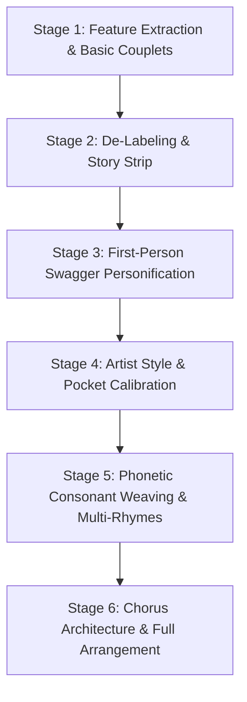

# 🎤 Lyric Crafting Skill — VoiceFi™

Specialized skill for turning features, technical documentation, architectural claims, and product capabilities into catchy, rhythmically locked, artist-calibrated rap lyrics, verses, and melodic hooks.

---

## 🎯 What This Skill Does

1. **Feature-to-Bar Distillation**: Converts dense feature matrices, tools, or capabilities into single-line punchy rhyming claims.
2. **First-Person Swagger Transformation**: Converts third-person passive descriptions (*"It does X"*) into active, bragging MC personifications (*"I do X with ease"*).
3. **Artist Pocket & Cadence Calibration**: Adapts syllable count, bounce, and delivery style to specific hip-hop artists (e.g., Sam Lachow, Logic, Mac Miller, Aminé, Kendrick, Outkast).
4. **Phonetic & Consonant Sound-Weaving**: Layers unexpected alliteration, plosives (**P, B, T, K**), sibilance (**S, C**), and multi-syllabic internal rhymes for effortless rhythmic delivery.
5. **Snare-Aligned Lead Sheet Notation (`💥` Method)**: Employs fixed-width visual notation placing a `💥` symbol directly beneath the exact launchpad syllable to anchor tempo and vocal landing.
6. **Syllable Cascade Engineering**: Formats 1, 2, or 3-syllable rolls between the snare downbeat and the final rhyming resolution.
7. **Hook & Chorus Architecture**: Crafts sticky 8-bar melodic sing-song hooks with call-and-response ad-libs.

---

## 🔄 The 6-Stage Lyric Crafting Pipeline

When tasked with writing rap lyrics or turning a list of features into a verse, follow this exact 6-stage progression:



---

### Stage 1: Feature Extraction & Basic Couplets
- Extract the core superpowers / features of the subject into concise, rhyming couplets (AABB).
- Ensure each discrete capability gets exactly one dedicated bar/line.

*Example:*
> **Active Listening:** Catching every spoken clue with acoustic grace,  
> It verifies your true intent without a missing trace.

---

### Stage 2: De-Labeling & Story Strip
- Remove all robotic bullet points, markdown bolding, tool names, and feature tags.
- Read lines sequentially to ensure uniform meter and natural transitions from bar to bar.

---

### Stage 3: First-Person Swagger Personification ("The MC Shift")
- Shift perspective from passive/third-person (*"The system does..."*, *"It helps you..."*) to active first-person boast (*"I catch..."*, *"I link..."*, *"I score..."*).
- Inject hip-hop intro ad-libs (*"Uh, check the mic..."*, *"Look..."*).

*Transformation:*
> ❌ *Passive:* "It turns messy brain dumps into clean plans."  
> ✅ *Active MC:* "I take your two AM insomnia and half-baked ramblin', / Turn that mental blender into blueprints you can handle, man."

---

### Stage 4: Artist Style & Pocket Calibration
Adapt the delivery to a target artist flow:
- **Sam Lachow / Mac Miller style:** Laid-back Seattle/bouncy pocket (~86–90 BPM), conversational charm, slight off-beat swing, witty self-production nods, half-smile delivery.
- **Logic / Eminem style:** High-speed 16th-note triplets, dense multi-syllabic chains, rapid-fire technical precision.
- **Slow-Groove / Half-Time Guitar Style (~60–65 BPM):** Apply the **5–7 Word Rule** to strip away tongue-twisters, giving huge breathing room and spacious pauses across the guitar chords.

---

### Stage 5: Phonetic Consonant Sound-Weaving
Upgrade standard rhymes into dense, percussive phonetic soundscapes:
1. **Plosives for Drum Impact:** Front-load **P, B, T, K** consonants so the vocal percussion hits right with the drum kick and snare.
   - *Example:* "**P**enning **p**reppy **p**unchlines, **p**oison in the **p**arasol, / **B**ouncing **b**attle **b**ars that hit like **b**illiards in a **b**reak hall."
2. **Sibilants & Liquids for Glide:** Weave **S, C, L, R, M, N** sounds for effortless speed.
   - *Example:* "**S**ifting **s**ubtle **s**yllables with **s**urgical **s**ensation."
3. **Multi-Syllabic Rhyme Clusters (3+ syllables matching):**
   - *acoustic acrobat* ➔ *whisper flat* ➔ *welcome mat*
   - *unicycle* ➔ *classic Michael*
   - *comedy* ➔ *propensity*
   - *insomnia* ➔ *confusion* ➔ *dilution*
4. **Metaphorical Bragging over Literal Descriptions:**
   - Instead of *"I integrate two AI agents"*, write *"Got Claude and Antigravity tandem on a unicycle / Tradin' heavy brainwaves slicker than a classic Michael."*

---

### Stage 6: Chorus Architecture & Song Arrangement
Construct an 8-bar melodic chorus that summarizes the overarching theme:
1. **Sing-Song Cadence:** Half-sung, bouncy melodic flow.
2. **Call-and-Response Ad-Libs:** Parenthetical vocal tags panned wide (*"Yeah, walk it out!"*, *"What you say?"*).
3. **Full 60-Second Social Reel Layout:**
   - `[Intro: 4 Bars]` (Ad-libs, beat drop)
   - `[Chorus: 8 Bars]` (Main hook)
   - `[Verse: 16 Bars]` (The skills / feature breakdown)
   - `[Chorus: 8 Bars]` (Hook replay)
   - `[Outro: 4 Bars]` (Fade out + punchline)

---

## 🎼 The Snare-Drop Lead Sheet Notation (`💥` Method)

To ensure the rapper never rushes or drags, format the verse in a **fixed-width monospace block** with a **`💥`** placed on the line directly below the launchpad syllable.

### 1. The Launchpad Principle
The snare `💥` marks the **launchpad**. It lands on the first stressed syllable of the final phrase, allowing the remaining syllables to roll smoothly into the rhyme.

```text
"...lay it on the WELCOME MAT"
                  💥
```

### 2. Syllable Cascade Varieties
* **0-Syllable Direct Punch:**
  ```text
  "...catch the whisper FLAT"
                        💥
  ```
* **1-Syllable Roll:**
  ```text
  "...fancy PHANTOM SPY"
            💥
  ```
* **2-Syllable Cascade:**
  ```text
  "...island TO THE COAST"
             💥
  ```
* **3-Syllable Rapid Cascade:**
  ```text
  "...zero STATIC ON THE MIC"
           💥
  ```

---

## 📋 Canonical Master Reference Example

### 🎵 The Chorus (Hook)
*(Melodic, sing-song bounce)*
```text
Ooh, I don’t even touch the keys no more,
Got the agents talkin' back while I be walkin out the DOOR!
(Yeah, walk it out!)
Hands-free, high-def, everything is smooth,
Voice in the pocket, locked into the groove.

Ooh, I don’t even type a word all day,
Just a whisper in the room and it’s on the way!
(What you say?)
Zero-millisecond latency, clean sound design,
Lookin' like the future crossin' finish line!
(Ayy, look—)
```

### 🎙️ The 16-Bar Verse (Slow-Groove Guitar Lead Sheet)

```text
Catch the whisper, keep it FLAT
                           💥

Lay it on the WELCOME MAT
              💥

In the standup, PHANTOM SPY
                💥

Log the notes till SPREADSHEETS FRY
                   💥

Claude and Antigravity, IN THE MIX
                        💥

Tradin' tasks without a CLICK
                        💥

Battle bars and LITTLE SKITS
                💥

Right where the POCKET HITS
                💥

Hands-free with a POCKET GHOST
                  💥

Audio from COAST TO COAST
           💥

Chop the beat and RENDER REELS
                  💥

Give the browser BRAND NEW WHEELS
                 💥

Speed it up and SAVE YOUR TIME
                💥

Turn your thoughts to A MASTERMIND
                        💥

Give the bots a CUSTOM TONE
                💥

Speak aloud, MAKE IT KNOWN!
             💥
```

---

## 🛠️ Prompting Guidelines for Agents

When a user asks to write rap lyrics, promo bars, or songs:
1. **Extract Core Value Propositions**: Gather the technical features or claims.
2. **Detect Tempo & Pocket**: Differentiate between fast boom-bap (~88 BPM) and slow-groove half-time (~60 BPM). Apply the 5–7 Word Rule when spacious breathing room is needed.
3. **Execute the 6-Stage Pipeline**: Transition from couplets $\rightarrow$ de-labeled verse $\rightarrow$ first-person bragging $\rightarrow$ phonetic consonant soundscapes $\rightarrow$ hook.
4. **Render Snare-Aligned Lead Sheets**: Always output the lyrics in fixed-width monospace notation with `💥` positioned on the line below the launchpad syllable.
