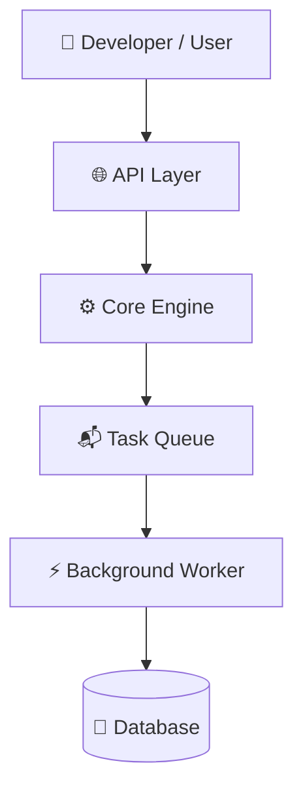

# 🧠 Voice Memo Buffer: Stream of Consciousness to Code

Captures long voice rambles, brain dumps, or pacing thoughts (2–5 minutes of unstructured spoken developer thought) with an elegant countdown timer UX, and automatically synthesizes the raw audio and transcript into:
1. **Implementation Plan** (Context, Architectural Decisions, Step-by-Step Execution Phases, Proposed Files)
2. **Mermaid Architectural Diagram** (Syntax-valid component and data flow visualization)
3. **GitHub-Flavored PR Checklist & Acceptance Criteria** (Actionable verification tasks, edge cases, risks)

---

## 🎯 When to Use This Skill
- When the developer says *"I want to talk about this for 3 minutes, go"*, *"Let me ramble about the architecture"*, or *"Capture this brain dump"*.
- When the developer has a complex or messy stream-of-consciousness idea and needs it synthesized into an Antigravity implementation plan.
- When ingesting long audio recordings (`.wav`, `.mp3`, `.m4a`) of developer discussions, design reviews, or pacing thoughts.

---

## 🚀 Quick Usage Commands

### 1. Start a 3-Minute Voice Memo Session
Starts a recording session with an elegant countdown timer and live energy meter:

```bash
# Default 3-minute capture:
vg memo record

# Or specify custom duration (e.g. 2m, 5m, 180s):
vg memo record -d 3m
vg memo record -d 5m

# Alias 'buffer' also supported:
vg buffer record -d 3m
```

### 2. Interactive Timer Controls
During the recording:
- **`[Enter]`**: Stop early and immediately synthesize.
- **`[Space]`**: Pause / Resume recording.
- **When Timer Lands (`00:00`)**: Plays a soft notification chime and displays extension options:
  - Press `1` for **+1 min** extension
  - Press `2` for **+2 min** extension
  - Press `3` for **+5 min** extension
  - Press `Enter` to finalize and begin thought synthesis

---

### 3. Synthesize Raw Speech or Brain Dumps
Transform any unstructured developer rambling directly into an implementation plan and Mermaid diagram:

```bash
# Synthesize raw text:
vg memo synth --text "So I'm thinking we need a background worker for video processing. It should pull tasks from Redis. Actually wait, let's use SQLite queues first to keep it self-contained for local dev. The worker should decode video, extract frames with ffmpeg, and write thumbnail images. We need an API endpoint POST /jobs and GET /jobs/:id. If ffmpeg fails, retry 3 times. We need unit tests for retry logic."

# Synthesize from a transcript file:
vg memo synth --file path/to/ramble.txt --title "Video Processing Worker"
```

---

### 4. Export Directly to Antigravity Planning Artifacts
To export a synthesized memo directly to Antigravity's active `implementation_plan.md` or macOS clipboard:

```bash
# Export to active Antigravity session artifact:
vg memo export <memo_id> -o "$HOME/.gemini/antigravity/brain/<conversation_id>/implementation_plan.md"

# Copy directly to clipboard:
vg memo export <memo_id> --clipboard
```

---

### 5. Managing Saved Voice Memos

```bash
# List all recorded brain dumps and memos:
vg memo list

# Display full synthesized plan:
vg memo show <memo_id>

# Inspect specific sections:
vg memo show <memo_id> --diagram     # Output Mermaid diagram only
vg memo show <memo_id> --checklist   # Output PR checklist only
vg memo show <memo_id> --transcript  # Output raw transcript only

# Import existing audio notes (.wav, .mp3, .m4a):
vg memo import path/to/voice_note.m4a

# Delete memo:
vg memo delete <memo_id>
```

---

## 🏗️ Structure of Synthesized Output
Every voice memo is synthesized into the following standard structure:

```markdown
# 🧠 Voice Memo: <Title>
**Synthesized from Developer Stream of Consciousness** | *ID: `<memo_id>`*

## 📋 Executive Summary
<Concise overview of technical objective>

### 🎯 Key Requirements & Objectives
- <Extracted requirement 1>
- <Extracted requirement 2>

### 🔄 Course Corrections & Pivots (Decisions Made)
- Course correction: <Detected course correction, e.g. SQLite instead of Redis>

---
## 🏗️ Architectural Diagram


---
## 🚀 Implementation Plan
**Goal**: <Primary goal>
**Context**: <Problem background>

### Proposed File Changes
- **[NEW]** `src/worker.py`: Background worker and queue processor
- **[MODIFY]** `src/models.py`: Database schema and state models

### Execution Steps
#### Step 1: Define Core Data Models & Schemas
#### Step 2: Implement Core Engine & Service Logic
#### Step 3: Comprehensive Testing & Verification

---
## ✅ PR Checklist & Acceptance Criteria
### Core Implementation
- [ ] Implement core components and data structures
- [ ] Expose necessary API endpoints / interfaces

### Testing & Verification
- [ ] Add automated unit tests verifying core execution path
- [ ] Verify edge case behavior and error recovery

### Edge Cases & Reliability
- [ ] Handle process interruptions and cancellations gracefully
- [ ] Ensure resource cleanup
```
