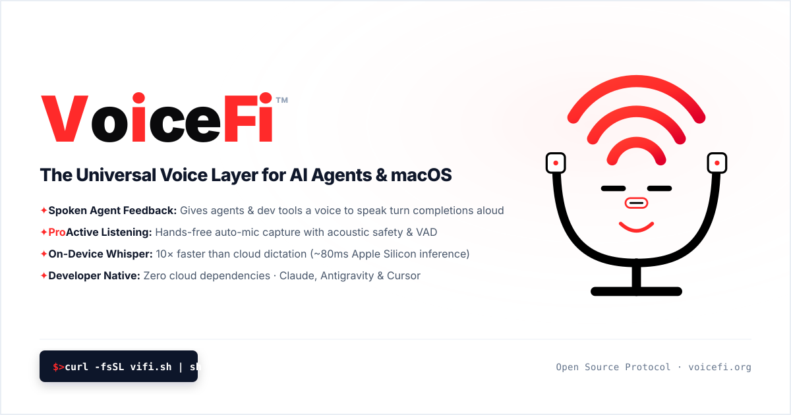

# VoiceFi™

<div align="center">



<br><br>

### **Give a voice to your agents, and agency to your voice.**  
*The Universal Ambient Voice Layer for AI Agents & macOS Desktop Computing.*

-blue.svg)
[](https://opensource.org/licenses/MIT)
[](https://python.org)
[](https://apple.com)

[](https://voicefi.org)

*U.S. Patent Application No. 63/137,300 — LienLogic Data LLC*

<br>

> *"A magnum opus may be flowing through me in this moment,*  
> *Expialidocious may be growing new trees like they golden.*  
> *Computer usage and voice translation proving they be a nuisance,*  
> *Download VoiceFi and be free to speak your movement."*

</div>

---

## ⚡ The Vision

Whether you are orchestrating a fleet of autonomous AI agents (**Antigravity, Claude Code, Cursor, Aider**) or navigating your everyday desktop workflow, **VoiceFi** eliminates the friction of chasing terminal tabs, babysitting split-panes, and clicking buttons.

1. **For AI Agents**: When your agent finishes writing code, running migrations, or executing tests in the background, VoiceFi speaks a brief soundbite, chimes, and auto-listens for your next instruction — completely hands-free.
2. **For Your Desktop**: Hit `Control + T` to dictate with local Whisper neural accuracy into Slack, Chrome, Notes, Terminal, or any text box on macOS. Hit `` ` `` (Backtick) to jump straight to your agent.

```
                  ┌─────────────────────────────────────────┐
                  │       Antigravity Finishes Turn         │
                  └────────────────────┬────────────────────┘
                                       │ (Stop Hook)
                                       ▼
                  ┌─────────────────────────────────────────┐
                  │   VoiceFi Summarizes & Speaks Aloud     │
                  │   "Tests passed! Ready to deploy?"      │
                  └────────────────────┬────────────────────┘
                                       │
                                       ▼
                  ┌─────────────────────────────────────────┐
                  │   Auto-Opens Mic with VAD & Listens     │
                  │   (No clicking buttons, hands-free)     │
                  └────────────────────┬────────────────────┘
                                       │
                                       ▼
                  ┌─────────────────────────────────────────┐
                  │   Whisper Transcribes & Injects Text    │
                  │   Submits prompt back to Antigravity    │
                  └─────────────────────────────────────────┘
```

---

## ✨ Features

- 🔄 **Hands-Free Agent Turn-Handoff**: Directly integrates into Antigravity lifecycle hooks (`hooks.json`). Announces agent status and listens for your voice command automatically.
- 🎯 **Smart Conversational Summarizer**: Cleanses raw markdown, code snippets, and logs to deliver brief, audible voice soundbites.
- 🎙️ **Voice Activity Detection (VAD)**: Real-time energy detection that knows when you start speaking and stops listening when you pause.
- 🔊 **Multi-Provider TTS (Text-to-Speech)**:
  - **Native macOS `say`** (Instant, zero latency, offline, supports Siri & system voices).
  - **Microsoft Edge Neural TTS** (Natural AI voices, free, no API key).
  - **ElevenLabs** (Pro tier / ultra-realistic cloned voices).
- 🧠 **Multi-Provider STT (Speech-to-Text)**:
  - **`faster-whisper`** (Runs 100% locally and offline on Apple Silicon / CPU).
  - **Groq Cloud Whisper** (~150ms instant cloud transcription).
  - **Apple Speech Framework** (macOS native speech recognition).
- 🖥️ **macOS Menu Bar Companion (`voicefi tray`)**: Lightweight menu bar item displaying live listening/speaking status and instant controls.
- ⌨️ **Global Desktop Voice Hotkey**: Press `<ctrl>+t` anywhere on macOS to dictate directly into any application.

---

## 🚀 Quickstart

### 1. Installation

Choose the installation method that fits your workflow:

#### ⚡ Quick Install (Terminal One-Liner)
```bash
curl -fsSL https://vifi.sh | bash
```

#### 🤖 For Claude Code & AI Agents (Two-Step Safe Download)
```bash
curl -fsSL https://vifi.sh -o /tmp/install.sh && bash /tmp/install.sh
```

#### 🛠️ Developer / Local Repo Install
```bash
git clone https://github.com/atxatlarge-code/voicefi.git
cd voicefi

# Option A: Run automated installer
./install.sh

# Option B: Install in virtual environment
uv venv --python 3.12
source .venv/bin/activate
uv pip install -e .
```

#### 📦 Python Package Manager
```bash
uv tool install voicefi
# or
pip install voicefi
```

### 2. Connect with Antigravity & AI Agents (1-Command Setup)

Run the automated setup to register the VoiceFi hooks:

```bash
vifi setup
# Or use the shorthand aliases:
vg setup
voicefi setup
```

Now, whenever Antigravity completes a task or asks a question, **VoiceFi** will speak the update, listen for your voice response, and paste it right back to the agent!

---

## 💻 CLI Usage

Both `voicefi` and the `vg` shorthand alias are available:

| Command | Description |
| :--- | :--- |
| `vg setup` / `voicefi setup` | Auto-registers VoiceFi lifecycle hook with Antigravity |
| `vg voice list` | Lists curated agent personas and neural voice catalog |
| `vg voice audition` | Plays live multi-voice showcase over speakers |
| `vg voice test <voice>` | Auditions a specific voice with sample text |
| `vg voice set <agent> <voice>` | Assigns a signature voice persona to an agent or subagent |
| `vg voice get` | Displays active voice assignments |
| `vg feedback submit <title>` | Submits bug reports, diagnostics, or voice tuning requests |
| `vg feedback list` | Lists recent feedback submissions |
| `vg hook` / `voicefi hook` | Executes Antigravity hook handler (called by `hooks.json`) |
| `vg listen` / `voicefi listen` | One-shot voice dictation (records, transcribes, pastes to active app) |
| `vg speak "Hello world"` | Speaks text aloud using configured TTS provider |
| `vg loop` / `voicefi loop` | Starts continuous hands-free voice loop in the terminal |
| `vg companion` / `vg remote` | Launches Web & Mobile Voice Companion with QR code pairing & PWA |
| `vg tray` / `voicefi tray` | Launches the macOS Menu Bar companion app |
| `vg memo record [-d 3m]` | Captures 2-5 min developer voice ramble with elegant countdown timer |
| `vg memo synth --text "..."` | Synthesizes stream-of-consciousness thoughts into Plan, Mermaid diagram & PR checklist |
| `vg memo list` | Lists recorded brain dumps and synthesized software plans |
| `vg memo show <id>` | Displays full synthesized implementation plan or Mermaid diagram |
| `vg memo export <id>` | Exports plan to markdown artifact or macOS clipboard |
| `vg info` / `voicefi info` | Displays active tier, audio devices, and voice models |

---

## ⚙️ Configuration

Configuration is stored at `~/.voicefi/config.yaml`. Customize your voices, models, and sensitivities:

```yaml
version: 1
tier: "community" # or "pro"

# Text-to-Speech
tts:
  provider: "mac_say" # "mac_say" | "edge_tts" | "elevenlabs"
  voice: "Samantha"   # e.g., "Samantha", "Alex", "en-US-ChristopherNeural"
  rate: 200

# Speech-to-Text
stt:
  provider: "whisper_local" # "whisper_local" | "groq" | "apple_speech"
  model_size: "base.en"     # "tiny.en" | "base.en" | "small.en"
  groq_api_key: ""

# Voice Activity Detection (VAD)
vad:
  mode: "hybrid"           # "hybrid" | "ptt" | "auto"
  silence_duration: 1.5    # Seconds of silence to finish listening
  energy_threshold: 0.003  # Mic sensitivity
  max_record_seconds: 45

# Antigravity Behavior
antigravity:
  auto_listen: true            # Automatically open mic after agent speaks
  read_summary_aloud: true     # Speak agent turn summary
  max_spoken_words: 25         # Soundbite word limit
  inject_to_active_window: true
```

---

## 💎 Community vs Pro Edition

| Feature | Community (MIT Open Source) | Pro Edition |
| :--- | :---: | :---: |
| **macOS Native `say` TTS** | ✅ | ✅ |
| **Microsoft Edge Neural TTS** | ✅ | ✅ |
| **Local Faster-Whisper (Offline)** | ✅ | ✅ |
| **Antigravity `Stop` Hook Integration** | ✅ | ✅ |
| **macOS Menu Bar Companion** | ✅ | ✅ |
| **Global Voice Dictation Hotkey** | ✅ | ✅ |
| **ElevenLabs High-Def Neural Voices** | — | ✅ |
| **Custom Wake Words ("Hey Antigravity")** | — | ✅ |
| **Multi-Agent Voice Dispatcher** | — | ✅ |
| **Commercial License & Support** | — | ✅ |

---

## 🧪 Testing

Run the automated test suite:

```bash
uv run pytest
```

Run the interactive hardware test (mic + speakers):

```bash
uv run python scripts/test_loop.py
```

---

## 📄 License & Patent Notice

- **Software License**: Licensed under the [MIT License](LICENSE).
- **Patent Notice**: *U.S. Patent Application No. 63/137,300* — LienLogic Data LLC.
- **Website**: [https://voicefi.org](https://voicefi.org)
