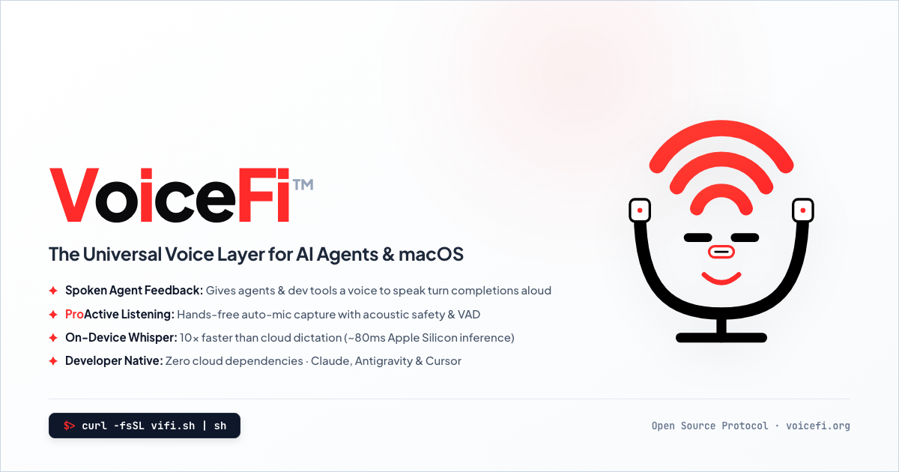

# VoiceFi™

<div align="center">



<br><br>

### **Give voice to your agents, and agency for your voice.**  
*The Universal Voice Layer for AI Agents, MCP, and macOS.*

<br>

<!-- BADGE MATRIX -->
[](LICENSE)
[](https://python.org)
[-lightgrey.svg?logo=apple&logoColor=white)](https://apple.com)
[](docs/MCP_ARCHITECTURE.md)
[](docs/DEV_WORKFLOWS.md)
[](https://voicefi.org)
[](#-license--patent-notice)

<br>

> *"A magnum opus may be flowing through me in this moment,*  
> *Expialidocious may be growing new trees like they golden.*  
> *Computer usage and voice translation proving they be a nuisance,*  
> *Download VoiceFi and be free to speak your movement."*

</div>

---

## ⚡ The Four Pillars of VoiceFi

VoiceFi transforms how developers interact with autonomous AI coding agents, terminals, and knowledge vaults on macOS.

```
                  ┌────────────────────────────────────────────────────────┐
                  │                 DEVELOPER DESKTOP / IDE                │
                  │   Google Antigravity • Claude Code • Cursor • Zed      │
                  └───────┬────────────────────────┬───────────────┬───────┘
                          │ (Stop Lifecycle Hooks) │ (MCP Stdio)   │ (Background IPC)
                          ▼                        ▼               ▼
                  ┌────────────────────────────────────────────────────────┐
                  │                      VOICEFI CORE                      │
                  │  ⚡ 0ms Offline Ava  •  🌉 Multi-Agent Bridge           │
                  │  🔌 Universal MCP    •  🎙️ Floating Cocoa HUD          │
                  └────────────────────────────────────────────────────────┘
```

1. ⚡ **0ms Instant Offline Neural Ava**:
   - Ultra-low latency, 100% private offline speech synthesis powered by Apple Silicon local neural engine (`Ava (Premium)` / `Samantha`).
   - Combined with local `faster-whisper` on-device speech recognition for complete privacy and zero cloud API token costs.

2. 🌉 **Antigravity ↔ Claude Code Multi-Agent Bridge**:
   - Autonomous cross-agent turn handoffs and task routing by Conversation ID.
   - Zero screen flicker and zero clipboard hijacking via native `agentapi` background IPC.
   - Built-in correlation tracking, automated reply routing, and acoustic banter / joke duels.

3. 🔌 **Universal Model Context Protocol (MCP) Server**:
   - Native Stdio JSON-RPC 2.0 server exposing 8 real-time audio tools to any MCP-compliant AI assistant (`voicefi_speak`, `voicefi_listen`, `voicefi_send`, `voicefi_sfx`, `voicefi_ping_voice`, `voicefi_stop`, `voicefi_status`, `voicefi_set_voice`).
   - Compatible with Google Antigravity, Claude Desktop, Cursor, Zed, and Windsurf.

4. 🎙️ **Floating Cocoa Dynamic Island HUD**:
   - Native macOS `NSPanel` glassmorphic capsule that rests unobtrusively under your MacBook notch ($155 \times 34\text{ px}$).
   - Dynamically morphs into expanded states with glowing aura halos, 5-bar live equalizer waveforms, and real-time streaming speech subtitles.

---

## 🚀 60-Second Quickstart

### 1. Install VoiceFi

Choose your preferred installation method:

#### 🍺 Homebrew (macOS Recommended)
```bash
brew install jaketrigg/tap/vifi
# Or:
brew tap atxatlarge-code/tap && brew install vifi
```

#### ⚡ Terminal One-Liner
```bash
curl -fsSL https://voicefi.org/install.sh | bash
```

#### 📦 Python Package Manager (`pip` / `uv`)
```bash
pip install voicefi
# Or with uv tool:
uv tool install voicefi
```

#### 🛠️ Developer / Local Repository
```bash
git clone https://github.com/atxatlarge/VoiceFi && cd VoiceFi
uv venv --python 3.12
source .venv/bin/activate
uv pip install -e .
vifi setup --dev
```

---

### 2. Configure 0ms Offline Speech

Download Apple's neural voice for instant, zero-latency speech:

```bash
vifi download-ava
```

---

### 3. Pair with AI Agents in 1 Command

Automatically detect and configure hooks and MCP servers for **Google Antigravity** and **Claude Code**:

```bash
vifi setup
```

Now, whenever Antigravity or Claude Code completes a task, runs a test suite, or requests feedback, **VoiceFi** will speak the summary aloud, open your microphone with Silero VAD, transcribe your response, and inject it straight back into the agent conversation!

---

### 4. Audition & Test

```bash
# Audition active voice persona:
vifi speak "VoiceFi is online and ready for paired programming."

# Test the full speak -> listen -> transcribe loop:
vifi feedback-loop

# Test silent connection latency and throughput:
vifi ping --all
```

---

## 🔌 Universal MCP Client Integrations

VoiceFi provides a native Model Context Protocol (MCP) server over standard input/output (`stdio`). Add VoiceFi to your favorite agent configuration:

### Google Antigravity
File: `~/.gemini/antigravity/mcp/voicefi.json`
```json
{
  "name": "voicefi",
  "command": "vifi",
  "args": ["mcp"]
}
```

### Claude Desktop
File: `~/Library/Application Support/Claude/claude_desktop_config.json`
```json
{
  "mcpServers": {
    "voicefi": {
      "command": "vifi",
      "args": ["mcp"]
    }
  }
}
```

### Cursor IDE
File: `.cursor/mcp.json` or `~/.cursor/mcp.json`
```json
{
  "mcpServers": {
    "voicefi": {
      "command": "vifi",
      "args": ["mcp"]
    }
  }
}
```

### Zed Editor
File: `~/.config/zed/settings.json`
```json
{
  "context_servers": {
    "voicefi": {
      "command": {
        "path": "vifi",
        "args": ["mcp"]
      }
    }
  }
}
```

### Windsurf
File: `~/.codeium/windsurf/mcp_config.json`
```json
{
  "mcpServers": {
    "voicefi": {
      "command": "vifi",
      "args": ["mcp"]
    }
  }
}
```

---

### Exposed MCP Tools (8 Native Tools)

| MCP Tool | Description |
| :--- | :--- |
| `voicefi_speak` | Synthesize and speak text aloud with Dynamic Island HUD subtitles. |
| `voicefi_listen` | Open microphone, record speech with Silero VAD, and transcribe to text. |
| `voicefi_stop` | Immediately halt ongoing TTS playback and dismiss HUD popup. |
| `voicefi_status` | Return active audio devices, voice personas, VAD thresholds, and server state. |
| `voicefi_set_voice` | Dynamically assign voice persona or provider to an agent or subagent. |
| `voicefi_ping_voice` | Benchmark silent TTS synthesis latency (TTFB) and throughput without playing audio. |
| `voicefi_send` | Dispatch cross-agent messages, findings, or tasks with conversation correlation tracking. |
| `voicefi_sfx` | Play comedy sound effects (`drum_smash`, `honk`, `sad_trombone`, `applause`, `boing`, `crickets`). |

---

## 📐 Architecture & Feedback-Loop Overview

VoiceFi creates an autonomous, full-duplex conversational loop between developers and AI coding agents:

```
┌────────────────────────────────────────────────────────┐
│               AI Coding Agent Completes Turn           │
│        (Antigravity / Claude Code / Cursor / Zed)      │
└───────────────────────────┬────────────────────────────┘
                            │ (Stop Lifecycle Hook / MCP)
                            ▼
┌────────────────────────────────────────────────────────┐
│            VoiceFi Smart Conversational Cleanser       │
│      Strips code/tables -> Synthesizes concise summary │
└───────────────────────────┬────────────────────────────┘
                            │
                            ▼
┌────────────────────────────────────────────────────────┐
│         Neural TTS Speaks Aloud (Ava / Samantha)       │
│           + Dynamic Island HUD Displays Subtitles      │
└───────────────────────────┬────────────────────────────┘
                            │
                            ▼
┌────────────────────────────────────────────────────────┐
│          Microphone Auto-Opens with Silero VAD         │
│     (Hands-free: Listens for your spoken response)     │
└───────────────────────────┬────────────────────────────┘
                            │
                            ▼
┌────────────────────────────────────────────────────────┐
│     Local Whisper Transcribes & Injects Background IPC │
│      (0 screen flicker -> Next Agent Turn Begins)      │
└────────────────────────────────────────────────────────┘
```

---

## 💎 Key Feature Matrix

| Feature | Community Edition (MIT) | Cloud / Pro |
| :--- | :---: | :---: |
| **0ms Apple Silicon Neural Ava (`mac_say`)** | ✅ Free & Private | ✅ Free & Private |
| **Local Faster-Whisper STT (On-Device)** | ✅ Free & Private | ✅ Free & Private |
| **Microsoft Edge Neural TTS (Free Online)** | ✅ Included | ✅ Included |
| **Autonomous Antigravity & Claude Code Hooks** | ✅ Included | ✅ Included |
| **Universal 8-Tool Stdio MCP Server** | ✅ Included | ✅ Included |
| **Floating Cocoa Dynamic Island HUD** | ✅ Included | ✅ Included |
| **Cross-Agent Dispatch & Joke Duels (`send`, `duel`, `sfx`)** | ✅ Included | ✅ Included |
| **Voice Memo Buffer & Plan Synthesizer (`memo`)** | ✅ Included | ✅ Included |
| **ProActive Ambient Meeting Co-Pilot (`ambient`)** | ✅ Included | ✅ Included |
| **Global `<ctrl>+t` macOS Dictation Hotkey** | ✅ Included | ✅ Included |
| **ElevenLabs High-Definition Custom Voices** | User API Key | Managed API |
| **Local F5-TTS Diffusion Voice Cloning Studio** | ✅ Included | ✅ Included |
| **Commercial License & Priority SLA** | MIT License | Enterprise SLA |

---

## 💻 Comprehensive CLI Cheat Sheet

VoiceFi exposes over 45 subcommands and aliases through the unified `vifi` CLI (also accessible via `voicefi`, `vg`, or `voicegency`).

### 1. Agent Pairing & MCP Lifecycle

| Command | Aliases | Description |
| :--- | :--- | :--- |
| `vifi setup` | — | Auto-configure agent lifecycle hooks & MCP servers (`--dev`, `--antigravity`, `--claude`, `--mcp`) |
| `vifi hook status` | `vifi hooks` | Show agent lifecycle hook installation and status |
| `vifi hook enable` / `disable` | — | Toggle agent Stop hooks in `~/.voicefi/config.yaml` |
| `vifi hook remove` | — | Cleanly unregister VoiceFi hooks from agent configuration files |
| `vifi mcp` | `vifi mcp-server` | Start native Model Context Protocol (MCP) Stdio JSON-RPC 2.0 server |
| `vifi onboarding` | — | Run interactive First-Time User Experience onboarding wizard |

### 2. Speech, Listening & Audio Hotkeys

| Command | Aliases | Description |
| :--- | :--- | :--- |
| `vifi speak "Text"` | — | Speak text aloud with active persona (`-a` agent, `-v` voice, `-p` provider, `-r` rate) |
| `vifi listen` | — | One-shot microphone dictation with VAD (`--no-inject`, `--no-enter`, `-q`) |
| `vifi loop` | — | Start continuous hands-free voice conversation loop in terminal |
| `vifi sfx [name]` | `vifi sound` | Play audio cues (`drum_smash`, `honk`, `sad_trombone`, `applause`, `boing`, `crickets`) |
| `vifi duel` | `vifi banter` | Run live acoustic joke duel benchmark (Ava ↔ Steffan personas) |
| `vifi bias [text]` | — | Inspect STT vocabulary biasing or test phonetic code normalization |

### 3. Voice Personas, Offline Ava & Benchmarks

| Command | Aliases | Description |
| :--- | :--- | :--- |
| `vifi voice list` | — | List curated neural voices and system voices (`-a` all, `--provider`) |
| `vifi voice test [voice]` | — | Audition a voice persona with custom text (`-t`, `-s` silent, `--phrase`, `-m` mic) |
| `vifi voice set <agent> <voice>` | — | Assign signature voice persona to an agent (`-q` quiet, `-p` provider, `-r` rate) |
| `vifi voice get` | — | Display active agent-to-voice mappings |
| `vifi voice rate [value]` | `vifi voice speed` | Get or set speech rate / speed (`75%`, `150`, `faster`, `slower`, `reset`) |
| `vifi voice audition` | — | Play multi-agent voice showcase across speakers |
| `vifi download-ava` | `vifi install-ava`, `setup-ava` | Download and configure Apple's Ava (Premium) neural voice for 0ms offline speech |
| `vifi ping [voice]` | `vifi speed-test`, `check-voice` | Silent TTFB latency, throughput (chars/s), and payload test (`--all`, `--json`, `-n`) |
| `vifi clone studio` | — | Launch local open-source voice cloning web studio (F5-TTS) |
| `vifi clone record <name>` | — | Record voice samples via interactive microphone wizard |
| `vifi clone import <name> <files>` | — | Train custom voice clone from existing audio files (`.wav`, `.mp3`) |
| `vifi clone list` / `delete` / `test` | — | Manage custom trained voice clone profiles |

### 4. Cross-Agent Dispatch & Conversations

| Command | Aliases | Description |
| :--- | :--- | :--- |
| `vifi send "Message" --to claude` | `vifi dispatch` | Send cross-agent message or task findings by Conversation ID (`--reply`, `--conv-id`) |
| `vifi new [prompt]` | `vifi new-conversation` | Start new AI conversation with connected tools (`-t` title, `-m` model) |

### 5. Dynamic Island HUD & Menubar

| Command | Aliases | Description |
| :--- | :--- | :--- |
| `vifi hud debug` | — | Launch interactive terminal Dynamic Island HUD Debug Studio with real-time keystroke triggers |
| `vifi hud open` / `close` | `hud start` / `stop` | Open or close the persistent Dynamic Island resting pill |
| `vifi hud on` / `off` | `hud enable` / `disable` | Enable or disable HUD display globally |
| `vifi hud status` | — | Display current HUD visibility and configuration settings |
| `vifi hud test` | — | Run automated 6-state HUD animation showcase |
| `vifi hud config` | — | Configure HUD properties (`--position`, `--persistent`, `--auto-send`, `--fullscreen-overlay`) |
| `vifi hud persistent [on/off]` | — | Toggle persistent resting pill mode ($155 \times 34\text{ px}$) |
| `vifi hud auto-send [on/off]` | — | Toggle instant auto-send vs interactive prompt review mode |
| `vifi hud fullscreen [on/off]` | — | Toggle overlay mode to stay visible above full-screen games/apps |
| `vifi hud reset` | `hud reset-position` | Reset HUD position to default top-center display anchor |
| `vifi tray` | — | Launch macOS menu bar companion app |

### 6. Hardware Diagnostics, VAD & Troubleshooting

| Command | Aliases | Description |
| :--- | :--- | :--- |
| `vifi troubleshoot` | `vifi test` | Run comprehensive automated diagnostic suite (`--json`, `-i` interactive, `--fix`) |
| `vifi feedback-loop` | `vifi loopback`, `voice-loop` | Test speak -> listen -> transcribe loopback roundtrip |
| `vifi hearing-test` | `vifi hearing` | Acoustic verification: Speak phrase and verify room microphone STT match % |
| `vifi barge-in` | `vifi test-barge-in` | Test mid-speech voice interruption with Silero VAD |
| `vifi vad` | — | Open Expert VAD & Acoustic Inspector Panel |
| `vifi permissions` | — | Check and open macOS Accessibility and Input Monitoring permissions |

### 7. Server Management & Lifecycle

| Command | Aliases | Description |
| :--- | :--- | :--- |
| `vifi status` | — | Display server state, active audio hardware, and port 5141 listener |
| `vifi dev` | — | Launch foreground dev mode with live console logs and auto-takeover |
| `vifi stop` | — | Safely terminate background server and free port 5141 |
| `vifi start` | — | Start background LaunchAgent server |
| `vifi restart` | — | Gracefully restart background server and reload configuration |
| `vifi server [action]` | `vifi daemon`, `service` | Manage background server & LaunchAgent service (`status`, `start`, `stop`, `restart`, `kill`) |
| `vifi kill` | — | Force terminate all VoiceFi processes and clear port 5141 |
| `vifi clean` | `vifi purge`, `reset-cache` | Purge stale bytecode, locks, and temporary cache (`--all`, `--dev`, `--servers`) |
| `vifi pause` / `resume` | — | Globally pause or resume all audio hooks and turn handoffs |
| `vifi autostart` | — | Register macOS LaunchAgent for automatic boot startup |
| `vifi stop-autostart` | — | Remove macOS LaunchAgent startup registration |
| `vifi update` | `vifi upgrade` | Self-updater: check and pull latest release (`--check`, `--repo`) |
| `vifi info` | — | Summary of system configuration and active voices |

### 8. Web Companion, Voice Memos & Knowledge Vaults

| Command | Aliases | Description |
| :--- | :--- | :--- |
| `vifi panel` | — | Launch interactive web voice control panel on `http://localhost:5141` |
| `vifi companion` | `vifi remote` | Launch Web & Mobile Voice Companion with QR code pairing (PWA) |
| `vifi memo record` | `vifi buffer record` | Record a 2–5 min voice memo with countdown timer (`-d 3m`, `-t` title, `-o` out) |
| `vifi memo synth` | `vifi buffer synth` | Synthesize stream-of-consciousness thoughts into structured PR plan & Mermaid diagram |
| `vifi memo list` / `show` / `export` | — | Browse, inspect, or export stored voice memos and diagrams |
| `vifi ambient start` | `vifi meeting start` | Start ProActive background meeting co-pilot (`--source mic/loopback`) |
| `vifi ambient status` | — | Show active meeting co-pilot status |
| `vifi obsidian install` | — | Install and enable VoiceFi plugin into local Obsidian knowledge vaults (`-v`, `-a`) |
| `vifi obsidian list` | — | List registered Obsidian vaults on local machine |
| `vifi stats` | `vifi analytics`, `insights` | View local developer turn volume, time saved, tool distributions, and latency (`-d`, `--today`, `--export`) |
| `vifi feedback submit "<title>"` | — | Submit zero-PII diagnostic report and telemetry feedback |
| `vifi feedback list` | — | List recent feedback submissions |

---

## ⚙️ Configuration Schema

VoiceFi configuration is stored at `~/.voicefi/config.yaml`. A standard configuration looks like:

```yaml
version: 1
tier: "community" # "community" | "pro"

# Text-to-Speech Engine
tts:
  provider: "mac_say"        # "mac_say" (0ms offline) | "edge_tts" | "elevenlabs"
  voice: "Ava (Premium)"     # "Ava (Premium)" | "Samantha" | "Aria" | "Christopher"
  rate: 200                  # Words per minute or percentage ("100%", "120%")
  read_summary_aloud: true

# Speech-to-Text Recognition
stt:
  provider: "whisper_local"  # "whisper_local" | "groq" | "apple_speech"
  model_size: "base.en"      # "tiny.en" | "base.en" | "small.en"
  language: "en"

# Voice Activity Detection (VAD) & Barge-In
vad:
  mode: "auto"               # "auto" (adapts to headphones vs speakers) | "hybrid" | "ptt"
  barge_in: "auto"           # Mid-speech interruption ("auto" | true | false)
  silence_duration: 1.5      # Seconds of silence to finish turn
  energy_threshold: 0.003    # Microphone sensitivity threshold

# Dynamic Island HUD
hud:
  enabled: true
  persistent: true           # Persistent resting pill under MacBook notch
  position: "top_center"     # "top_center" | "top_right" | "top_left"
  auto_send: true            # Instant submission vs interactive edit mode
  live_transcript: true      # Stream real-time speech transcription typing

# Agent Specific Settings
antigravity:
  auto_listen: true
  max_spoken_words: 35
  inject_mode: "agentapi"     # Zero-flicker background IPC
```

---

## 📚 Developer Documentation & Guides

- 🚀 **[Developer Workflows & Pipelines](docs/DEV_WORKFLOWS.md)**: Deep dive into terminal and MCP integration patterns.
- 📐 **[MCP Architecture Specification](docs/MCP_ARCHITECTURE.md)**: Model Context Protocol design and multi-agent dispatching.
- 🎙️ **[Dynamic Island HUD Design Guide](docs/HUD_DESIGN_GUIDE.md)**: Glassmorphic HUD specifications and interactive debug studio.
- 🎭 **[Cross-Agent Comedy & Banter Spec](docs/CROSS_AGENT_COMEDY_SPEC.md)**: Technical spec for acoustic joke duels and sound effect cues.
- 🤖 **[Agent Persona & Troubleshooting Guide](AGENTS.md)**: Hardware diagnostics, voice barge-in tuning, and multi-agent persona assignments.
- 🗺️ **[Development Roadmap](ROADMAP.md)**: Three-phase growth roadmap from CLI launch to voice store marketplace.
- 🤝 **[Contributing Guidelines](CONTRIBUTING.md)**: Local development setup, testing standards, and PR workflows.
- 📜 **[Code of Conduct](CODE_OF_CONDUCT.md)**: Community standards based on Contributor Covenant v2.1.
- 🔒 **[Security Policy](SECURITY.md)**: Vulnerability reporting and zero-PII privacy guarantees.

---

## 🧪 Testing & Quality Assurance

Run the test suite:

```bash
# Run unit tests
uv run pytest

# Run MCP and CLI integration tests
uv run pytest tests/test_mcp_server.py tests/test_cli_layout.py tests/test_chimes.py
```

Run acoustic and hardware verification:

```bash
# Hardware diagnostic profile
vifi troubleshoot --json

# Simultaneous speak + listen loopback
vifi feedback-loop

# Acoustic room reception hearing test
vifi hearing-test
```

---

## 📄 License & Patent Notice

- **Software License**: Licensed under the [MIT License](LICENSE).
- **Patent Notice**: *U.S. Patent Application No. 63/137,300* — LienLogic Data LLC.
- **Website**: [https://voicefi.org](https://voicefi.org)
