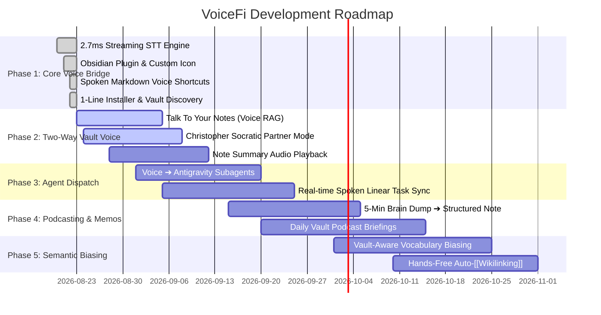

# 🗺️ VoiceFi™ Product & Engineering Roadmap
> **"Second Brain, Second Voice • The Universal Voice & Agency Layer for Knowledge Vaults & Autonomous Agents."**

***

## 🌟 Vision
VoiceFi transforms static text knowledge bases (Obsidian, markdown vaults) and developer toolchains into **Autonomous Conversational Operating Systems**. We bridge raw human speech, studio-quality neural personas, and autonomous AI subagents into a unified, zero-latency feedback loop.

---

## 📍 Milestones & Execution Status

---

## 🚀 Phase 1: Real-Time Dictation & Vault Bridge *(COMPLETED ✅)*
- [x] **2.7ms Real-Time Streaming STT:** Pre-warmed local Whisper engine on Apple Silicon Neural Engine with zero cloud roundtrips.
- [x] **Obsidian Ribbon Plugin & Custom Brand Icon:** Fused studio shockmount & smiling robot face ribbon icon registered in Obsidian.
- [x] **Spoken Markdown Shortcuts:** Hands-free voice formatting (`"New line"`, `"New paragraph"`, `"Bullet [text]"`, `"Task [text]"`, `"Heading one/two"`).
- [x] **Atomic Anchor Replacement:** Seamless live ghost text streaming without flickering or accidental text deletion.
- [x] **Self-Healing Daemon:** Automatic background engine auto-spawn upon clicking the Obsidian ribbon icon.
- [x] **Modular 1-Line Installer:** Interactive `[Y/n]` Obsidian vault auto-discovery in `install.sh` and dedicated `vifi obsidian install` CLI.

---

## 🟡 Phase 2: Two-Way Conversational Vault ("Talk to Your Notes") *(IN PROGRESS)*
- [ ] **Voice Vault Q&A (Spoken RAG):**
  - Ask questions about your notes out loud (*"VoiceFi, what were the 3 key takeaways from the Viking Trail pitch note?"*).
  - VoiceFi searches active vault markdown notes via embeddings / semantic search and responds with cited sources.
- [ ] **Studio Neural Persona Audio Playback:**
  - Full voice synthesis spoken directly by **Christopher** (default), **Sonia** (analyst), **Guy** (pair programmer), or **Aria** (energetic QA).
  - Hotkey / ribbon button: *"VoiceFi: Read Selection Aloud"* with variable playback speed control.
- [ ] **Socratic Brainstorming Partner:**
  - Interactive back-and-forth conversational mode where VoiceFi challenges assumptions, identifies logical gaps, and asks clarifying questions out loud while you pace.

---

## 📋 Phase 3: Autonomous Agent Dispatch & MCP Architecture *(PLANNED • [Architecture Spec](docs/MCP_ARCHITECTURE.md))*
- [ ] **Universal `voicefi-mcp` Server:**
  - Standardized Model Context Protocol server exposing `voicefi_speak`, `voicefi_ask_confirmation`, and `voicefi_get_ambient_context` to Antigravity, Claude Code, Cursor, Windsurf, and Zed.
  - Multi-agent neural acoustic personas (Christopher, Sonia, Guy, Aria) for distinct subagent auditory feedback.
- [ ] **Voice-to-MCP Client Dispatcher:**
  - Ambient speech directly triggers external MCP servers (Slack, Linear, Postgres, GitHub, DevTools) without manual typing.
  - Dedicated hands-free Slack workflows (morning standups, thread catch-up summaries, polished DM dispatch).
- [ ] **Voice-to-Subagent Orchestration:**
  - Command background coding agents directly from speech (*"VoiceFi, dispatch a subagent to write unit tests for the auth module"*).
  - Real-time spoken auditory confirmation (*"Starting QA subagent on branch auth-tests..."*).
- [ ] **Hands-Free Task Triage & Linear Sync:**
  - Spoken action items automatically parsed into `- [ ]` markdown checkboxes in Obsidian.
  - 1-click or voice-triggered synchronization to **Linear tickets** or GitHub Issues.
- [ ] **Auditory Build & Test Status Alerts:**
  - Spoken notifications when long-running background tasks or CI builds finish (*"All 48 tests passed on branch feat/streaming"*).

---

## 📋 Phase 4: Smart Brain Dump Synthesis & "Podcast Mode" *(PLANNED)*
- [ ] **5-Minute Walking Voice Memo Synthesis:**
  - Record raw, unstructured, stream-of-consciousness brain dumps on iPhone/Mac while walking.
  - VoiceFi strips filler words, extracts key insights, creates structured markdown sections, and saves directly to `Vault/Voice Memos/YYYY-MM-DD-Brainstorm.md`.
- [ ] **"Daily Briefing" Podcast Mode:**
  - Generates a customized 2–3 minute audio briefing every morning summarizing open tasks, yesterday's modified notes, and priority items.
- [ ] **Mobile Companion PWA & Apple Watch Trigger:**
  - Remote dictation and listening from phone / smartwatch synced over WebSocket to desktop Obsidian vault.

---

## 📋 Phase 5: Vault-Aware Semantic Biasing & Auto-Wikilinking *(PLANNED)*
- [ ] **Vault Vocabulary Biasing:**
  - Scans active vault note titles, aliases, YAML frontmatter, and code identifiers to bias the speech recognizer in real time.
  - 100% accurate spelling for proprietary concepts, company names (*LienLogic*), and project titles (*VikingTrail*).
- [ ] **Hands-Free Auto-[[Wikilinking]]:**
  - Automatically identifies concepts in spoken sentences and converts them into clickable `[[Note Title]]` links on the fly.
- [ ] **Obsidian Community Plugin Directory Submission:**
  - Official release submission to Obsidian's native community plugin registry for 1-click install inside Obsidian Settings.

---

## 📜 Intellectual Property
* **U.S. Patent Application No.:** 64/137,300 (*Ambient Voice-Driven Autonomous AI Agent Orchestration, Intent Verification, and Acoustic Cognitive Safety*)
* **Copyright:** © 2026 LienLogic Data LLC. All Rights Reserved.
