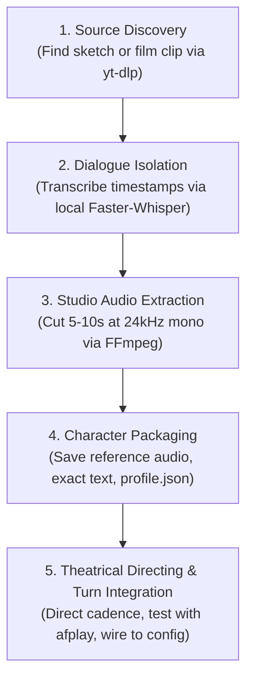

# 🎭 Authentic Voice Character Template — The "Sketch-to-Character" Blueprint

> **Purpose:** A standardized, repeatable pipeline for transforming iconic film and sketch performances into distinct, affective AI voice characters on Apple Silicon (F5-TTS & MLX).

---

## 💡 The Core Principle: Performance Cloning vs. Timbre Cloning

Traditional voice cloning tries to capture a generic speaker profile from clean interviews. This creates **flat, uncanny results** because:

1. **Diffusion models inherit performance energy:** Neural flow-matching (F5-TTS) does not just clone frequency timbre; **it clones the exact emotional posture, breath tension, vocal fry, and projection of the reference audio**.
2. **Actors play characters, not themselves:** Christopher Walken in *The Continental* has a completely different pitch floor, rasp, and vocal pacing than Walken in *More Cowbell* or Walken in an interview about film pragmatism.
3. **The Rule:** If you want a voice character to sound like a specific comedic persona, **the reference seed audio MUST be an authentic clip of the actor performing that specific character**.

```
┌────────────────────────────────────────────────────────────────────────────────────────┐
│                        The Character Seed Architecture                                │
├──────────────────────────────┬───────────────────────────┬─────────────────────────────┤
│ ❌ Generic Interview Seed    │ ❌ Synthetic TTS Seed     │ ✅ Authentic Character Seed │
├──────────────────────────────┼───────────────────────────┼─────────────────────────────┤
│ "Movies are a pragmatic..."  │ Edge TTS GuyNeural        │ "Each bubble like the story"│
│ Outcome: Flat, boring clone  │ Outcome: Synthetic robot  │ Outcome: Pure velvet suave  │
│ Zero comedic timing          │ Uncanny valley            │ Authentic Walken rasp       │
└──────────────────────────────┴───────────────────────────┴─────────────────────────────┘
```

---

## 🛠️ The 5-Step Pipeline (Repeatable Template)



---

### Step 1: Source Discovery & Download
Fetch clean source audio from an authentic recording (YouTube, film rip, or audio library):

```bash
# Search and download best audio stream directly to WAV
yt-dlp -x --audio-format wav -o "/tmp/raw_character_source.%(ext)s" "<YOUTUBE_URL_OR_SEARCH>"
```

*Example:*
```bash
yt-dlp -x --audio-format wav -o "/tmp/continental.%(ext)s" "https://www.youtube.com/watch?v=0vuOnVNiYtg"
```

---

### Step 2: Dialogue Timestamping via Local Whisper
Run local Faster-Whisper to scan dialogue and identify the optimal 5-to-10 second character monologue:

```python
from faster_whisper import WhisperModel

model = WhisperModel("base.en", device="cpu", compute_type="int8")
segments, _ = model.transcribe("/tmp/raw_character_source.wav", beam_size=5)

for s in segments:
    print(f"[{s.start:6.2f}s -> {s.end:6.2f}s]: {s.text}")
```

**What to look for in the candidate slice:**
* **Duration:** 5.0 to 9.0 seconds (sweet spot for F5-TTS).
* **Isolation:** Zero background music, laugh tracks, or overlapping voices during that clause.
* **Character Archetype:** Contains the actor's signature delivery (e.g., Walken's velvet monologue, not someone else talking).

---

### Step 3: Studio Extraction & Normalization (FFmpeg)
Slice the audio to 24kHz Mono 16-bit PCM WAV (the native sample rate for F5-TTS / Vocos):

```bash
ffmpeg -y \
  -ss <START_TIMESTAMP> \
  -to <END_TIMESTAMP> \
  -i /tmp/raw_character_source.wav \
  -ar 24000 \
  -ac 1 \
  ~/.voicefi/cloned_voices/<actor_name>/<character_id>/ref_<character_id>.wav
```

*Example (The Continental):*
```bash
ffmpeg -y \
  -ss 00:03:25.0 \
  -to 00:03:32.2 \
  -i /tmp/continental.wav \
  -ar 24000 \
  -ac 1 \
  ~/.voicefi/cloned_voices/christopher_walken/continental/ref_continental_bubble.wav
```

**Verify the exact transcription text:**
```bash
# Transcribe slice to get 100% accurate ref_text
voicefi listen --file ~/.voicefi/cloned_voices/christopher_walken/continental/ref_continental_bubble.wav
# Output: "Each bubble like the story of one's life. Would you like to hear my story?"
```

---

### Step 4: Character Packaging

Store files in the standard VoiceFi cloned voice hierarchy:

```
~/.voicefi/cloned_voices/<actor_name>/<character_id>/
├── ref_<character_id>.wav     # 24kHz mono master slice (5-10s)
├── ref_<character_id>.txt     # Verbatim reference transcript
└── profile.json               # Character metadata & default turn stinger
```

*Example `profile.json`:*
```json
{
  "id": "walken_continental",
  "name": "The Continental",
  "actor": "Christopher Walken",
  "archetype": "Suave Absurdity / Velvet Monologue",
  "ref_audio": "~/.voicefi/cloned_voices/christopher_walken/continental/ref_continental_bubble.wav",
  "ref_text": "Each bubble like the story of one life. Would you like to hear my story?",
  "speed": 0.92,
  "nfe_step": 24,
  "default_stinger": "Wow... look at you. Champagne... and a clean build. Does it get any better? I don't think so.",
  "lead_in_phrases": [
    "Wow... look at you.",
    "Champagne?",
    "Mmm... beautiful.",
    "Does it get any better?"
  ]
}
```

---

### Step 5: Theatrical Directing & Turn Integration

#### A. Direct Script Cadence in `TheatricalDirector`
Ensure [`TheatricalDirector.direct_walken_cadence`](../src/voicefi/tts/director.py) formats dynamic text to match the character's pause style:

```python
# Format incoming turn summary with character's rhythm:
directed = "Wow... look at you. Champagne... and a clean build. Does it get any better? I don't think so."
```

#### B. Synthesize & Audition
```python
from voicefi.tts.f5_tts import F5TTS
from pathlib import Path

tts = F5TTS(
    ref_audio="~/.voicefi/cloned_voices/christopher_walken/continental/ref_continental_bubble.wav",
    ref_text="Each bubble like the story of one life. Would you like to hear my story?",
    speed=0.92,
    nfe_step=24,
)

tts.speak_to_file(directed, "/tmp/audition.wav")
# Play on CoreAudio:
# afplay /tmp/audition.wav
```

#### C. Wire into VoiceFi Turn Completion
Update `~/.voicefi/config.yaml`:
```yaml
tts:
  provider: local_clone
  voice: christopher_walken
  f5_nfe_step: 24
  f5_ref_audio: ~/.voicefi/cloned_voices/christopher_walken/continental/ref_continental_bubble.wav
  f5_ref_text: "Each bubble like the story of one life. Would you like to hear my story?"
```

---

## 📋 The Walken Character Seed Checklist

| Character | Source Scene | Seed Line (`ref_text`) | Target Delivery |
| :--- | :--- | :--- | :--- |
| **Bruce Dickinson** | *SNL More Cowbell* | *"Guess what? I got a fever, and the only prescription is more cowbell."* | High energy, project leader shouting |
| **The Continental** | *SNL The Continental* | *"Each bubble like the story of one's life. Would you like to hear my story?"* | Low energy, velvet robe, suave rasp |
| **The Census Man** | *SNL Census Taker* | *"Counting me? Approximately... one."* | Flat deadpan, long bewildered pauses |
| **Captain Koons** | *Pulp Fiction* | *"Five long years... he wore this watch."* | Serious dramatic gravity, quiet intensity |
| **The Lion** | *Poolhall Junkies* | *"Every now and then, the lion has to show the jackals who he is."* | Gravelly street fable, wise pacing |

---

## ⚡ Summary of Why This Works
1. **Zero Artificial Guesswork:** The model doesn't have to "guess" how Walken would speak softly or sarcastically; the acoustics of that performance are baked into the conditioning mel-spectrogram.
2. **Infinite New Lines:** You can have The Continental read real coding tasks, test results, or git commits while preserving the exact comedic timing of the original sketch.
3. **Completely Local & Airgapped:** Runs on Apple Silicon Metal GPU at ~0.98x RTF with zero external cloud dependencies.
