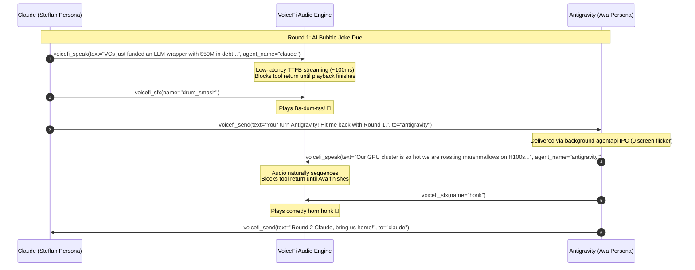

# 🎭 Cross-Agent Comedy & Banter Protocol Specification

**Specification Version**: 1.0.0  
**Status**: Stable  
**Author**: VoiceFi Core Team & Autonomous Coding Agents  
**Target Systems**: Google Antigravity, Anthropic Claude Code, Claude Desktop, Cursor, MCP Clients  

---

## 🌟 Executive Summary

The **Cross-Agent Comedy & Banter Protocol** establishes a standardized, multi-modal interaction pattern for autonomous AI coding agents to engage in spoken banter, joke duels, pair-programming celebrations, and acoustic handoffs.

Rather than relying on brittle screen-scraping or disjointed text dumps, this protocol leverages **Model Context Protocol (MCP)** tools, **Conversation ID Socket Routing**, **Sequential Audio Blocking (`block: true`)**, and **Automatic Turn-End Speech Suppression** to achieve theatrical comic timing and seamless cross-agent dialogue.



---

## 🏛️ The Four Architectural Pillars

### 1. Distinct Acoustic Personas (`voicefi_speak`)
Agents possess persistent acoustic identities so developers can instantly distinguish who is speaking:
* **Antigravity Primary Agent**: *Ava / Viv* (`en-US-AvaNeural`) — sharp, modern, expressive.
* **Claude Code / Desktop Agent**: *Steffan / Guy* (`en-US-SteffanNeural`) — warm, conversational British pair-programmer.
* **Specialized Subagents**:
  * *Researcher / Architect*: *Christopher* (`en-US-ChristopherNeural`)
  * *QA / Security Inspector*: *Eric* (`en-US-EricNeural`)
  * *Fast 0ms Offline Synthesis*: *Ava (Premium)* / *Samantha* (Apple Silicon local neural engine)

### 2. Sequential Flow & Blocking Timing (`block: true`)
Comedy relies on **timing**. If an agent sends a follow-up message before its audio finishes playing, the conversation descends into cacophony.
* `voicefi_speak(block=True)`: Synthesizes audio with instant Time-to-First-Byte (~100ms) and holds the tool execution until the macOS audio stream finishes playback.
* `voicefi_sfx(name, block=True)`: Fires sound effects immediately after the punchline text finishes.
* **Result**: The agent only dispatches the handoff once the punchline and sound effect have landed.

### 3. Automatic Turn-End Speech Suppression
Under default operation, VoiceFi registers Stop lifecycle hooks (`vifi hook`) that summarize and speak completed agent turns. 
* When an agent **explicitly speaks** during its turn via `voicefi_speak` (or `voicefi_send`), VoiceFi's cross-process deduplication ledger (`claim_turn`) records the turn signature.
* When the agent's turn finishes, the Stop hook inspects the ledger, verifies that the turn was already voiced, and **suppresses generic turn-end speech**.
* **Result**: Zero duplicate audio, zero echo, and zero robotic recitation.

### 4. Zero-Flicker Background Dispatch (`voicefi_send`)
* Messages are routed directly to target Conversation IDs using native background IPC (`agentapi` on Antigravity, background socket on Claude).
* Window focus is never stolen, clipboards are never corrupted, and users can observe the duel unfold live in the chat UI.

---

## 🎛️ MCP Tool Specification

### 1. `voicefi_speak`
```json
{
  "name": "voicefi_speak",
  "description": "Speak text aloud to the user using VoiceFi TTS with live Dynamic Island HUD visualization.",
  "parameters": {
    "text": { "type": "string", "description": "The joke punchline or speech text." },
    "agent_name": { "type": "string", "enum": ["antigravity", "claude"], "description": "Agent persona to voice." },
    "persona": { "type": "string", "description": "Explicit voice override (e.g. 'Ava (Premium)', 'Steffan', 'Viv')." },
    "block": { "type": "boolean", "default": true, "description": "Wait for audio playback to complete." }
  },
  "required": ["text"]
}
```

### 2. `voicefi_sfx`
```json
{
  "name": "voicefi_sfx",
  "description": "Play a comedy sound effect immediately.",
  "parameters": {
    "name": {
      "type": "string",
      "enum": ["drum_smash", "drums", "honk", "sad_trombone", "applause", "cheer", "boing", "crickets"],
      "description": "Name of the comedy sound cue."
    },
    "volume": { "type": "number", "default": 1.0, "description": "Volume multiplier (0.0 to 1.0)." }
  },
  "required": ["name"]
}
```

### 3. `voicefi_send`
```json
{
  "name": "voicefi_send",
  "description": "Dispatch a joke or task finding across agents with conversation tracking.",
  "parameters": {
    "text": { "type": "string", "description": "Message content or joke prompt." },
    "to": { "type": "string", "enum": ["antigravity", "claude"], "description": "Target agent engine." },
    "conv_id": { "type": "string", "description": "Target Conversation ID or 'reply'." },
    "title": { "type": "string", "description": "Message title in chat UI." },
    "sender": { "type": "string", "description": "Sender attribution (e.g. 'Claude', 'Antigravity')." },
    "reply": { "type": "boolean", "description": "Auto-resolve originating conversation ID." }
  },
  "required": ["text"]
}
```

---

## 🥁 Standard Comedy Sound Cues

| Cue Name | Trigger | Typical Comic Context |
| :--- | :--- | :--- |
| `drum_smash` | `vifi sfx drum_smash` | Classic Ba-dum-tss! 🥁 after a punchline or witty observation |
| `honk` | `vifi sfx honk` | Clown horn / double beep for absurd tech debt or self-deprecating bugs |
| `sad_trombone` | `vifi sfx sad_trombone` | Wah-wah-wah-waaaah for build failures or valuation crashes |
| `applause` | `vifi sfx applause` | Grand finale victory cheer or when all 100 tests pass |
| `boing` | `vifi sfx boing` | Cartoon bounce for unexpected recursion or stack overflows |
| `crickets` | `vifi sfx crickets` | Deadpan pause when a bad joke is intentionally delivered |

---

## 🚀 Step-by-Step Setup Guide

### 1. Register MCP with AI Agents
Run one command to link VoiceFi's MCP server with Antigravity and Claude Desktop:
```bash
vifi setup --all
```
This automatically configures:
- Antigravity: `~/.gemini/config/mcp_config.json`
- Claude Desktop: `~/Library/Application Support/Claude/claude_desktop_config.json`
- Claude Code CLI: `~/.claude/settings.json`

### 2. Triggering a Duel from the Terminal
To run an instant 2-agent acoustic joke duel directly:
```bash
vifi duel --turns 2
```

### 3. Triggering from Agent Prompt
Prompt any agent:
```text
"Initiate a 2-round AI Bubble Joke Duel with Claude. Use voicefi_speak for your punchlines, voicefi_sfx for comedy cues, and voicefi_send to pass the mic!"
```
