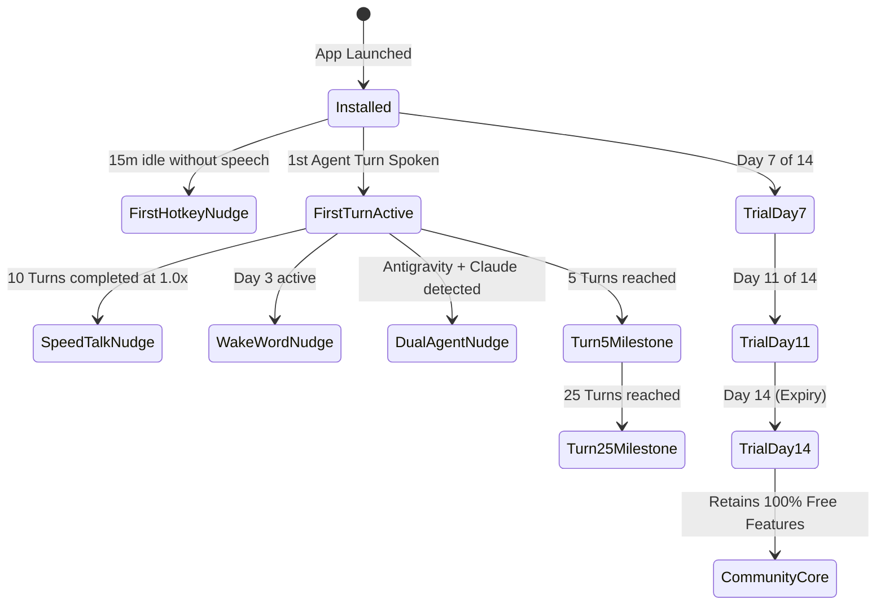

# VoiceFi™ DMG User Onboarding & Progressive Lifecycle Specification

**Universal Voice Layer for AI Agents, MCP & macOS**  
*Document Version: 1.0.0 — September 2026*

---

## 1. Executive Summary

When distributing a native macOS application via disk image (`.dmg`), the user journey spans four distinct touchpoints:
1. **The Web Download**: Transitioning from landing page to local file system.
2. **The Disk Image Mount**: The visual presentation in Finder and handling user interaction (drag vs direct launch).
3. **The First-Run Experience (FTUE)**: macOS permissions, instant audio verification, and developer environment linking.
4. **Progressive Lifecycle Nudges**: Guiding habit formation, power feature discovery, milestone celebrations, and subscription transitions.

This specification details the architecture, UI design, and execution protocols required to create a frictionless, high-converting macOS onboarding flow.

---

## 2. Complete User Journey Architecture


---

## 3. Phase 1: Web Pre-Download & Post-Click Experience (`voicefi.org`)

### Problem
Clicking *"Download .dmg"* on `voicefi.org/download.html` triggers a standard browser file download. The web page remains static, leaving the user without instructions on what to look for or do next.

### Specification
When the download is triggered, the page immediately presents a high-polish, lightweight **Post-Download Overlay Drawer**:

```
+-------------------------------------------------------------------------+
|  🎉 VoiceFi for Mac is Downloading...                                  |
|                                                                         |
|  [ 1. Check Downloads ]      [ 2. Drag & Drop ]      [ 3. Dictate ]     |
|         ⬇️                          📦 ➔ 📁                 🎙️         |
|   Open VoiceFi.dmg            Drag to Applications    Press Control + T  |
|                                                                         |
|  Did the download not start? [Click here to restart download]          |
|  Browsing on your phone? [Send download link to your Mac]              |
+-------------------------------------------------------------------------+
```

1. **Visual Direction**: An animated arrow gestures toward the browser's download manager (top-right on Safari/Chrome, bottom-left on Firefox).
2. **Retry Link**: Explicit fallback link if the browser blocked automatic file downloads.
3. **Mobile Lead Capture**: For developers visiting on iOS/Android, an email input box to send the direct DMG link to their desktop workstation.

---

## 4. Phase 2: DMG Presentation & App Translocation Protection

### Problem: The "Direct Launch from DMG" Pitfall
A significant percentage of macOS developers double-click `VoiceFi.app` directly inside the mounted disk image rather than dragging it to `/Applications`.
- macOS mounts disk images as **read-only**.
- macOS Gatekeeper subjects the app to **App Translocation**, moving the execution binary into a temporary randomized sandbox directory (`/private/var/folders/.../AppTranslocation/...`).
- **Failure Modes**:
  1. Auto-updates cannot replace the running bundle.
  2. LaunchAgent configurations break when pointing to a transient mount point.
  3. When the user ejects the volume or reboots, VoiceFi disappears completely from their Mac.

### Solution: In-App Translocation Guard (`translocation.py`)
Upon launch, VoiceFi executes a self-location inspection before acquiring locks or mounting the tray:

```python
def check_and_prompt_move_to_applications():
    """Detect if running from a disk image or translocation and prompt to move."""
    exec_path = Path(sys.executable).resolve()
    
    is_in_volume = "/Volumes/" in str(exec_path)
    is_translocated = "AppTranslocation" in str(exec_path)
    is_in_apps = str(exec_path).startswith("/Applications/")
    
    if (is_in_volume or is_translocated) and not is_in_apps:
        # Show native Cocoa NSAlert
        # [ Move to Applications Folder ] (Default)
        # [ Run from Disk Image ]
```

#### Move Execution Protocol:
1. Present a native `NSAlert`:
   - **Header**: *"Move VoiceFi to Applications?"*
   - **Message**: *"VoiceFi works best when installed in your Applications folder. This ensures background auto-updates, global hotkeys, and AI agent hooks stay connected across reboots."*
2. If confirmed:
   - Use `NSFileManager` or `shutil.copytree` to copy the source `.app` bundle to `/Applications/VoiceFi.app`.
   - Remove quarantine flags: `xattr -dr com.apple.quarantine /Applications/VoiceFi.app`.
   - Launch the newly installed copy: `open /Applications/VoiceFi.app`.
   - Unmount the DMG volume: `hdiutil detach /Volumes/VoiceFi -force -quiet`.
   - Gracefully terminate the temporary instance (`sys.exit(0)`).

---

## 5. Phase 3: Native AppKit First-Time User Experience (FTUE) Wizard

The existing `VoiceFiWelcomeWindow` is transformed from a static license text box into an engaging, multi-step interactive onboarding wizard (`NSPanel` / `NSWindow`).

```
+-------------------------------------------------------------------------+
|  🎙️ VoiceFi Setup & Permissions                               [Step 2 of 4] |
+-------------------------------------------------------------------------+
|                                                                         |
|   macOS System Permissions                                              |
|   VoiceFi runs entirely locally on your Mac. To enable hands-free      |
|   dictation and speech interruption, please grant the following:        |
|                                                                         |
|   +-----------------------------------------------------------------+   |
|   | 🎙️  Microphone Access                              [ Granted ✅ ]|   |
|   |     Required for high-speed local voice-to-text dictation.      |   |
|   +-----------------------------------------------------------------+   |
|                                                                         |
|   +-----------------------------------------------------------------+   |
|   | ⌨️  Accessibility Access               [ Open System Settings ➔ ]|   |
|   |     Required for the universal Control+T hotkey and Esc stop.   |   |
|   |     VoiceFi never reads your screen or keystrokes.              |   |
|   +-----------------------------------------------------------------+   |
|                                                                         |
|   [ < Back ]                                           [ Continue ➔ ]   |
+-------------------------------------------------------------------------+
```

### The 5 Wizard Steps:
1. **Step 1: Welcome & Audio Greeting**:
   - High-DPI VoiceFi avatar.
   - Viv automatically greets the developer out loud via CoreAudio:
     *"Welcome to VoiceFi! Let's get your microphone and hotkeys set up in thirty seconds."*
   - Immediately proves that speech synthesis is functional on the host machine.
2. **Step 2: Permissions Walkthrough**:
   - **Microphone**: Calls `AVCaptureDevice.requestAccessForMediaType_` to trigger the native macOS permission popup. Shows real-time green checkmark once granted.
   - **Accessibility**: Calls `AXIsProcessTrustedWithOptions({kAXTrustedCheckOptionPrompt: True})`. If untrusted, provides a 1-click button opening `System Settings > Privacy & Security > Accessibility`.
3. **Step 3: Interactive Hotkey Practice (The "AHA!" Moment)**:
   - Interactive prompt: *"Hold Control + T and say: 'Hey Viv, let's build something awesome'."*
   - Real-time visualizer animates with voice RMS energy.
   - Speech-to-text transcribes directly into the window in sub-300ms.
   - Viv replies aloud: *"Loud and clear! Your voice loop is active."*
4. **Step 4: AI Agent & Tool Discovery**:
   - Scans the user's system for installed coding assistants:
     - 🤖 **Antigravity**: Detected $\rightarrow$ auto-links CLI hook.
     - 🟣 **Claude Code**: Detected $\rightarrow$ registers `vifi hook --agent claude`.
     - ⚡ **Cursor / VS Code / Terminal**: Configured for universal dictation.
5. **Step 5: 14-Day Free Pro Trial Activation**:
   - Checks clipboard: if a `VF1-PRO-...` key exists, auto-activates Pro.
   - Otherwise, auto-starts the **14-day full Pro trial** (no credit card required).
   - Shows an illustrative indicator pointing up to the **macOS Menu Bar** and **Dynamic Island HUD**:
     *"VoiceFi will now live quietly in your menu bar. Press Control+T anytime to dictate."*

---

## 6. Phase 4: Progressive Lifecycle Notifications & Educational Reminders

To help developers build productive habits without notification spam, VoiceFi implements an event-driven `LifecycleManager`.

### Guiding Principles:
- **Maximum 1 Tip per 24 Hours**: Sliding window rate-limiting.
- **Triggered by Context, Not Arbitrary Clocks**: Tips only fire when relevant to what the user just did or didn't do.
- **Respects Do Not Disturb**: Suppressed during active meetings or macOS focus modes.
- **1-Click Opt-Out**: Developers can mute all educational tips from the menu bar preferences at any time.

### Lifecycle Trigger Rules:



### Notification Catalog:

| ID | Timing / Trigger | Notification Title & Message | Action on Click |
| :--- | :--- | :--- | :--- |
| `nudge_hotkey_reminder` | 15 min after setup if 0 turns | **VoiceFi is Ready 🎙️**<br>Press `Control+T` in any application to speak your prompt. | Focuses active app / menu bar |
| `nudge_turn_controls` | Upon completion of 1st turn | **🎙️ Spoken Turn Active**<br>Press `Esc` to stop speech immediately, or `Option+Tab` to jump to the speaking agent. | Dismisses notification |
| `nudge_speed_talk` | After 10 turns at normal speed | **⚡ Save 40% of Listening Time**<br>Speed Talking accelerates agent speech (1.5x–2.5x) with zero pitch distortion. | Enables Speed Talking |
| `nudge_wakeword` | Day 3 of active usage | **Hands-Free Wake Word 🗣️**<br>Say "Hey Viv" or press `Control+Space` to summon the Quick Prompt Bar. | Opens Quick Prompt Bar |
| `nudge_cross_agent` | Antigravity + Claude both found | **🤖 Multi-Agent Pair Programming**<br>Delegate tasks between agents using `vifi send "Review this code" --to claude`. | Opens documentation |
| `nudge_mobile_pwa` | Day 5 of active usage | **📱 VoiceFi on Mobile**<br>Pace around while your agents code. Click to pair your iPhone or iPad via PWA. | Opens pairing QR code |
| `milestone_turn_5` | 5th spoken turn completed | **🎉 5 Spoken Agent Turns!**<br>Enjoying hands-free pair programming? Support VoiceFi with a GitHub star ⭐ | Opens GitHub repository |
| `milestone_turn_25` | 25th spoken turn completed | **⚡ Productivity Milestone**<br>You've saved ~20 minutes of gaze fatigue this week. Run `vifi stats` to see insights. | Opens stats dashboard |
| `trial_day_7` | Day 7 of 14-day trial | **✨ 7 Days Left on Pro Trial**<br>All 20+ neural voices & cloud relays are active. Run `vifi tier` anytime to inspect. | Opens `voicefi.org#pricing` |
| `trial_day_11` | Day 11 of 14-day trial | **⏳ 3 Days Remaining on Pro Trial**<br>Keep 20+ neural voices with Developer Pro ($9/mo). Community Core stays free forever. | Opens `voicefi.org#pricing` |
| `trial_day_14` | Day 14 (Trial Expiry) | **VoiceFi Pro Trial Ends Today**<br>Community Core remains active with local Apple Ava (0ms TTS) and Whisper STT. | Opens `voicefi.org#pricing` |

---

## 7. Configuration Schema & User Preferences

In `~/.voicefi/config.yaml`:

```yaml
lifecycle:
  enable_tips: true                # Master toggle for educational reminders
  max_tips_per_day: 1              # Rate limiting
  quiet_hours_start: "22:00"       # Do not disturb window
  quiet_hours_end: "08:00"
  muted_nudges: []                 # List of dismissed nudge IDs
```

In `~/.voicefi/lifecycle.json` (Internal State):
```json
{
  "installed_at": 1726050000.0,
  "last_notification_ts": 1726053600.0,
  "total_spoken_turns": 8,
  "delivered_nudges": [
    "nudge_hotkey_reminder",
    "nudge_turn_controls",
    "milestone_turn_5"
  ],
  "trial_reminders_sent": [7]
}
```

---

## 8. Rollout & Validation Strategy

1. **Unit & State Testing**:
   - `tests/test_lifecycle.py`: Validate debounce timers, quiet hours, JSON persistence, and idempotency.
   - `tests/test_translocation.py`: Validate disk image path detection and relocation commands under mock environments.
2. **End-to-End DMG Verification**:
   - Build native `.dmg` via `python scripts/build_dmg.py`.
   - Mount disk image on clean test machine.
   - Double-click `VoiceFi.app` directly in disk image: verify "Move to Applications" prompt appears and relocates app.
   - Launch app from `/Applications`: verify AppKit wizard opens with audio greeting and permissions checklist.
