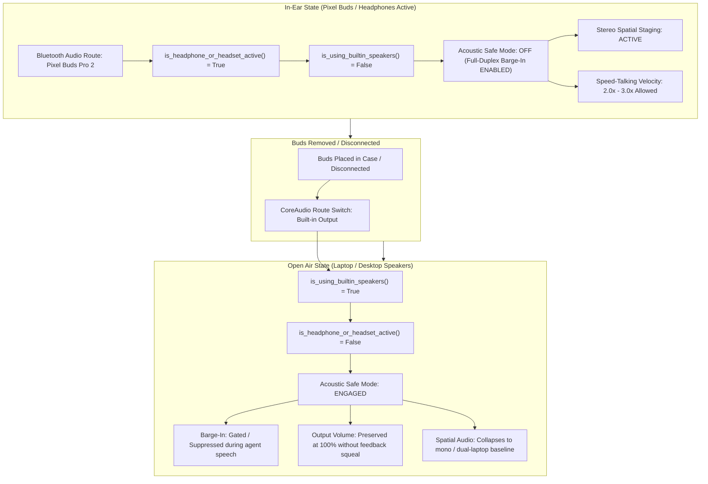

# 🎧 Hardware Acoustic Profiles, Wearable Adapters & Pixel Buds Pro 2 — VoiceFi™

> **Acoustic Reality:** An AI agent system that outputs audio through MacBook laptop speakers must behave fundamentally differently than one delivering sound directly into a developer's ear canal.

---

## 🌟 Overview & Architecture

VoiceFi dynamically adapts its conversational audio loop based on the physical acoustic environment. When audio outputs into open air, speaker sound waves bounce off walls and enter the microphone, causing **acoustic echo bleed** and false barge-in triggers. When audio outputs into sealed headphones, physical isolation eliminates loopback entirely.

This document details:
1. **Dynamic Hardware State Adaptation** (what happens when you put in or take off earbuds).
2. **The Hardware Compatibility Matrix** (what turns on for all headphones vs. what is exclusive to Pixel Buds Pro 2).
3. **Runtime Invariants & Fallback Behaviors**.

---

## 🔄 Dynamic Lifecycle: What Happens When You Take Buds Off?

VoiceFi continuously monitors active audio routes via [`src/voicefi/audio/device.py`](../src/voicefi/audio/device.py) and [`src/voicefi/audio/recorder.py`](../src/voicefi/audio/recorder.py).



### The 3 Removal Scenarios:

| Scenario | What the Hardware Does | What VoiceFi Does |
| :--- | :--- | :--- |
| **1. You put Buds in the Charging Case** | Bluetooth connection severs. macOS CoreAudio or Android audio immediately re-routes to built-in speakers. | [`resolve_barge_in_mode()`](../src/voicefi/audio/recorder.py) senses `is_using_builtin_speakers() == True`. It **instantly engages Acoustic Safe Mode**. The agent finishes its current sentence over laptop speakers without falsely cutting itself off. |
| **2. You speak to someone in the room (Buds stay in ear)** | **Pixel Buds Pro 2 Tensor A1 Conversation Detection** detects your voice, automatically pauses media playback, and activates Transparency Mode. | Playback halts at the OS/MediaSession layer. The WebSocket audio buffer pauses. Once you finish speaking and pause for 2–3 seconds, the buds disengage Transparency Mode and VoiceFi resumes playback. |
| **3. You set Buds on the desk (out of case)** | Buds remain connected via Bluetooth (macOS does not have native optical ear-detection pause for non-Apple buds). | Audio continues playing quietly through the buds on the desk. Barge-in remains open. (To prevent this, place the buds inside their pebble charging case or tap pause). |

---

## 📊 Feature Matrix: Universal vs. Pixel Buds Pro 2 Exclusive

Not all features are locked to specific hardware. VoiceFi implements a **graceful tiered capability model**:

| Feature | Any Headphones / AirPods / IEMs | Google Pixel Phone + Any Earbuds | Pixel Buds Pro 2 Exclusive |
| :--- | :---: | :---: | :---: |
| **Automatic Barge-In Unlock (Acoustic Safe Mode Disengage)** | ✅ **Universal** | ✅ **Universal** | ✅ **Universal** |
| **Spatial Stereo Multi-Agent Staging (Left/Right Ear)** | ✅ **Universal** | ✅ **Universal** | ✅ **Universal** |
| **Speed-Talking Acceleration (1.5x – 3.0x)** | ✅ **Universal** | ✅ **Universal** | ✅ **Universal** |
| **Untethered Remote Companion Pacing (`vifi companion`)** | ✅ **Universal** | ✅ **Universal** | ✅ **Universal** |
| **Tensor Gboard 0ms On-Device STT Fast-Path** | ❌ (Cloud Whisper / Web STT) | ✅ **Pixel Tensor Hardware** | ✅ **Pixel Tensor Hardware** |
| **Hardware Conversation Detection (Auto-Pause to Talk to Room)** | ❌ | ❌ | ✅ **Tensor A1 Chip** |
| **Silent Seal 2.0 (2x Mid-Band Vocal Range Cancellation)** | ❌ (Standard ANC) | ❌ | ✅ **Pixel Buds Pro 2** |
| **Hands-Free Gemini Live Hotword Trigger ("Hey Google, let's talk")** | ❌ | ❌ | ✅ **Pixel Buds Pro 2** |

---

## 🛠️ Deep Dive into Key Capabilities

### 1. Dynamic Acoustic Safe Mode (`src/voicefi/audio/recorder.py`)
- **Laptop Speaker Problem:** If an agent is speaking at 80% volume on a MacBook Pro, the built-in microphone picks up that exact audio. Without safe mode, the Silero VAD thinks the *developer* is talking and cuts the agent off after 1 word.
- **Headphone Solution:** The second you put in Pixel Buds, AirPods, or wired headphones, `is_headphone_or_headset_active()` returns `True`. VoiceFi knows physical air isolation exists. It completely opens full-duplex barge-in so you can interrupt the agent mid-stream naturally.

### 2. Spatial Multi-Agent Audio Staging
- When running paired agent workflows (e.g., Antigravity + Claude Code via [`cross-agent-bridge`](../.agents/skills/cross-agent-bridge/SKILL.md)):
  - **Antigravity (Lead Orchestrator):** Panned **Left Ear** (`pan = -0.55`) using voice persona *Puck* or *Charon*.
  - **Claude Code / Verifier:** Panned **Right Ear** (`pan = +0.55`) using voice persona *Fenrir* or *Aoede*.
  - **MusicFX Ambient Beat:** Centered (`pan = 0.0`), mastered at -16 LUFS, and ducked 12 dB during agent turns.
- **Works on:** Any stereo earbud or headset automatically.

### 3. Pixel Buds Pro 2 Hardware Conversation Detection
- Powered by the **Tensor A1 chip** running on-device acoustic models at 90x sound speed.
- If someone walks into your office while an agent is reading a 30-line code plan, you simply say *"Hey, what's up?"*.
- The Pixel Buds Pro 2 instantly engage Transparency mode and pause audio stream. You do not have to fumble for a mute button or take your phone out of your pocket.

---

## 🧪 How to Verify Your Current Setup

Run the built-in diagnostic command:

```bash
vifi doctor
```

Under the **Audio Hardware Profile** section, look for:
```yaml
Audio Device Profile:
  Default Input: "Pixel Buds Pro 2"
  Default Output: "Pixel Buds Pro 2"
  Is Headphone Active: true
  Acoustic Safe Mode Recommended: false
  Active Isolation Mode: "Physical Headphone Isolation"
```

If you disconnect your buds and re-run:
```yaml
Audio Device Profile:
  Default Input: "MacBook Pro Microphone"
  Default Output: "MacBook Pro Speakers"
  Is Headphone Active: false
  Acoustic Safe Mode Recommended: true
  Active Isolation Mode: "Acoustic Safe Mode"
```
VoiceFi handles the entire acoustic switch automatically with zero configuration required.
