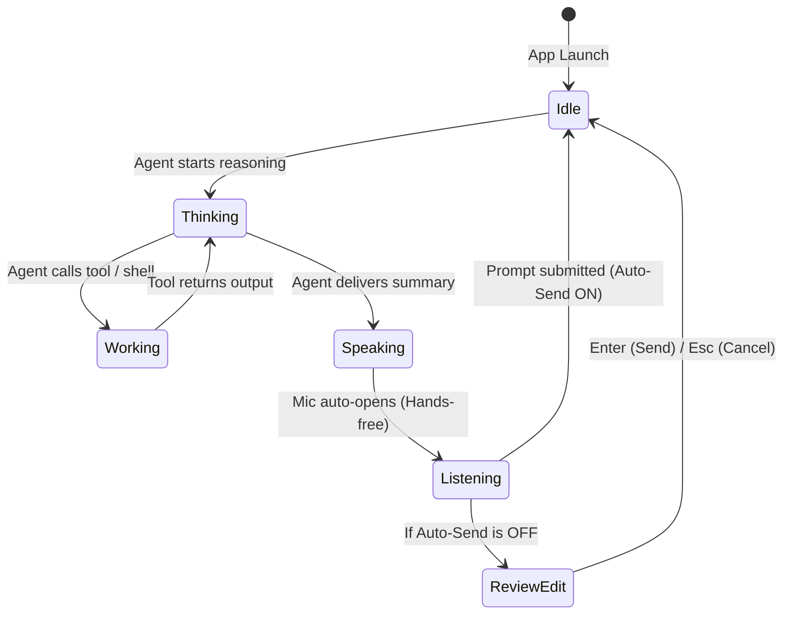

# 🎙️ VoiceFi Dynamic Island HUD — Design & Architecture Guide

This document is the official design specification and reference for the **VoiceFi Unified Dynamic Island HUD** on macOS.

---

## 📌 Executive Summary & "Why does it look plain/small at rest?"

VoiceFi uses an **Apple Dynamic Island-style fluid morphing architecture**:
- **At Rest (Idle State):** The HUD intentionally collapses into a minimalist **$155 \times 34\text{ px}$ persistent pill** (`🎙️ VoiceFi • Ready`) anchored directly under the MacBook camera notch / top-center display so it never occludes your code editor or steals focus.
- **In Active Motion (Active States):** As soon as an agent reasons, speaks, listens, or executes tools, the HUD animates smoothly into an expanded **$440\text{–}480\text{ px}$ glassmorphic capsule** complete with glowing aura halos, avatar badges, subagent persona labels, animated acoustic waveform bars, and live streaming transcription.

---

## 🎨 Interactive Mocks & Live Debug Tooling

You can design, preview, and test the HUD across two environments:

### 1. Interactive Web Mockup (Browser Canvas)
Located at [`mocks/hud_mocks.html`](file:///Users/jaketrigg/Projects/VoiceFi/mocks/hud_mocks.html).
```bash
# Open directly in your default browser:
open mocks/hud_mocks.html

# Or via the VoiceFi Companion Server:
# http://localhost:5050/hud_mocks.html
```
**Features:**
- Real-time 5-phase morph switcher (`Idle`, `Thinking`, `Working`, `Speaking`, `Listening`).
- Voice Persona switcher (Christopher, Aria, Guy, Sonia, William).
- CSS Backdrop blur (`blur(28px)`), spring physics, and animated audio equalizer waveforms.
- Auto-Morph Demo button to watch fluid state cycles automatically.

---

### 2. Native macOS Interactive Debug Studio
Trigger the native `NSPanel` directly on your Mac display without needing an active agent session:
```bash
# Launch interactive CLI studio:
uv run voicefi hud debug
# or:
vg hud debug
```
**Keybindings in Debug Studio:**
| Key | Action | Visual Representation |
| :--- | :--- | :--- |
| `1` | **State: IDLE** | Compact resting capsule ($155 \times 34\text{ px}$) |
| `2` | **State: THINKING** | Reasoning aura ($420 \times 54\text{ px}$) with purple halo |
| `3` | **State: WORKING** | Tool execution capsule ($460 \times 58\text{ px}$) with blue halo |
| `4` | **State: SPEAKING** | Live speech subtitles ($480 \times 84\text{ px}$) with cyan halo & voice persona |
| `5` | **State: LISTENING** | Microphone VAD ($480 \times 64\text{ px}$) with streaming live typing |
| `6` | **State: REVIEW & EDIT** | Interactive prompt editing container ($480 \times 94\text{ px}$) |
| `P` | **Toggle Persistent Mode** | Toggle between always-visible resting pill vs auto-hide |
| `A` | **Toggle Auto-Send** | Instant submission vs interactive edit mode |
| `C` | **Clear / Force Hide** | Hide HUD immediately |
| `Q` | **Exit Debug Studio** | Returns terminal to normal |

---

## 📐 HUD State Anatomy & Geometric Specifications



---

### Phase 1: IDLE (Resting Capsule)
- **Geometry:** Width: `155px`, Height: `34px`, Corner Radius: `17px`
- **Backdrop:** Apple HUD Glass (`NSVisualEffectMaterialHUDWindow`) with subtle white border `rgba(255,255,255,0.2)`
- **Content:** Centered single-line label: `🎙️ VoiceFi • Ready` (12.5pt medium font)

---

### Phase 2: THINKING (Reasoning Indicator)
- **Geometry:** Width: `420px`, Height: `54px`, Corner Radius: `27px`
- **Aura / Border:** Violet Halo `rgba(139, 92, 246, 0.65)` with breathing glow
- **Content:**
  - Avatar Badge: `🧠` (Purple glow background)
  - Title: Agent Name (e.g. `Antigravity`, `Claude Code`)
  - Tag: `• Thinking / Reasoning`
  - Subtitle: Active reasoning step or prompt analysis

---

### Phase 3: WORKING (Tool Action Indicator)
- **Geometry:** Width: `460px`, Height: `58px`, Corner Radius: `29px`
- **Aura / Border:** Azure Blue `rgba(59, 130, 246, 0.6)`
- **Content:**
  - Avatar Badge: `⚡` (Blue glow background)
  - Title: Agent Name
  - Tag: `• Tool Execution`
  - Subtitle: `Running pytest tests/` or `Reading src/voicefi/config.py`

---

### Phase 4: SPEAKING (Live Voice Subtitles)
- **Geometry:** Width: `480px`, Height: `84px`, Corner Radius: `24px`
- **Aura / Border:** Cyan Halo `rgba(6, 182, 212, 0.6)`
- **Content:**
  - Avatar Badge: Persona Icon (e.g. `🧔` Christopher, `⚡` Aria, `🔬` Sonia)
  - Title: Agent Name + Persona Tag (`• Christopher`)
  - Tag: `🔊 Speaking`
  - Visualizer: 5-bar animated audio equalizer waveform
  - Subtitle: Real-time speech text being spoken aloud over speakers

---

### Phase 5: LISTENING (Real-Time Mic & Live Typing Stream)
- **Geometry:** Width: `480px`, Height: `64px`, Corner Radius: `24px`
- **Aura / Border:** Emerald Green Pulse `rgba(16, 185, 129, 0.7)`
- **Content:**
  - Avatar Badge: `🎙️` (Green glow background)
  - Title: User Name (e.g. `Jake`)
  - Tag: `👂 Listening (VAD Active)`
  - Subtitle: Live Whisper transcription streaming in real-time with cursor `▌`

---

### Phase 6: REVIEW & EDIT (Interactive Capsule)
- **Geometry:** Width: `480px`, Height: `94px`, Corner Radius: `20px`
- **Aura / Border:** Indigo Accent `rgba(99, 102, 241, 0.7)`
- **Content:**
  - Header: `✏️ Review & Edit Prompt (Enter to Send • Esc to Cancel):`
  - Text Field: Editable native `NSTextField` pre-filled with recognized speech
  - Buttons: `Send (Enter)` and `Cancel (Esc)`

---

## 🛠️ Codebase Architecture & File Mapping

| Purpose | Implementation File |
| :--- | :--- |
| **Native macOS HUD Implementation** | [`src/voicefi/ui/unified_hud.py`](file:///Users/jaketrigg/Projects/VoiceFi/src/voicefi/ui/unified_hud.py) |
| **Interactive HTML/CSS Design Mockup** | [`mocks/hud_mocks.html`](file:///Users/jaketrigg/Projects/VoiceFi/mocks/hud_mocks.html) |
| **CLI & Debug Studio Commands** | [`src/voicefi/cli.py`](file:///Users/jaketrigg/Projects/VoiceFi/src/voicefi/cli.py) (`cmd_hud`) |
| **HUD Configuration Schema** | [`src/voicefi/config.py`](file:///Users/jaketrigg/Projects/VoiceFi/src/voicefi/config.py) (`HUDConfig`) |
| **Menu Bar Tray Integration** | [`src/voicefi/ui/tray.py`](file:///Users/jaketrigg/Projects/VoiceFi/src/voicefi/ui/tray.py) |
| **Unit Tests & State Matrix Verification** | [`tests/test_unified_hud.py`](file:///Users/jaketrigg/Projects/VoiceFi/tests/test_unified_hud.py) |

---

## 🚀 How to Iterate on the HUD Design

1. **Iterate in HTML/CSS first:**
   Edit [`mocks/hud_mocks.html`](file:///Users/jaketrigg/Projects/VoiceFi/mocks/hud_mocks.html) with Tailwind CSS classes to experiment with spacing, colors, font sizes, glassmorphism blur, and animations.
2. **Translate to Native AppKit:**
   Update layout dimensions, `NSFont`, `NSColor`, and view frames in [`src/voicefi/ui/unified_hud.py`](file:///Users/jaketrigg/Projects/VoiceFi/src/voicefi/ui/unified_hud.py).
3. **Verify immediately:**
   Run `uv run voicefi hud debug` to test live native rendering and transitions directly on macOS.
