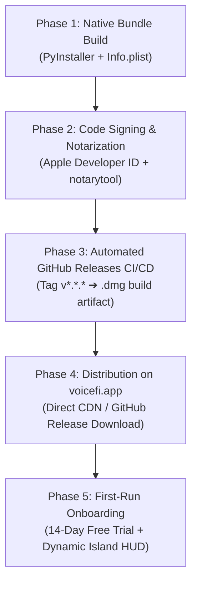

# VoiceFi™ macOS DMG Packaging, Signing & Launch Playbook

Complete end-to-end operational guide for building, signing, notarizing, and distributing the native **VoiceFi.app** bundle and **VoiceFi macOS `.dmg`** disk image.

---

## 🗺️ Master Release Architecture



---

## 📦 Phase 1: Native Bundle & DMG Creation

### 1. Bundle Structure
The build script generates a native macOS application bundle:
* **App Bundle**: `dist/VoiceFi.app`
* **Installer Disk Image**: `dist/VoiceFi_v1.0.0_macOS.dmg`
* **Volume Name**: `VoiceFi`
* **Bundle Identifier**: `org.voicefi.app`

### 2. Embedded Native Assets & Dependencies
* `VoiceFi.icns`: Multi-resolution Retina macOS application icon.
* `apple_speech_stream`: Native Swift helper binary for 0ms on-device streaming transcription.
* `src/voicefi/companion/static/`: Embedded HTML5/PWA assets for local control panel & remote mobile companion.
* `src/voicefi/sfx/`: Native audio feedback sound effects (drum rolls, applauses, bells).
* Python Runtime: Single standalone bundled executable via PyInstaller.

### 3. macOS Permissions & Metadata (`Info.plist`)
Configured automatically by [`scripts/build_dmg.py`](../scripts/build_dmg.py):

| Plist Key | Type | Value | Description |
| :--- | :--- | :--- | :--- |
| `LSUIElement` | `bool` | `true` | Runs as an agent/menu bar app (no unwanted Dock clutter). |
| `NSHighResolutionCapable` | `bool` | `true` | Full Retina display resolution for the Dynamic Island HUD. |
| `CFBundleDisplayName` | `string` | `VoiceFi` | Application name in Activity Monitor & Menu Bar. |
| `NSMicrophoneUsageDescription` | `string` | *"VoiceFi requires microphone access to listen to your voice commands for AI agents."* | Privacy prompt shown on first mic capture. |
| `NSSpeechRecognitionUsageDescription` | `string` | *"VoiceFi uses speech recognition to convert your voice to text."* | Local speech transcription permission. |
| `NSAppleEventsUsageDescription` | `string` | *"VoiceFi needs AppleScript access to focus your AI agent and inject transcribed text."* | Window focusing & smart injection. |
| `NSAccessibilityUsageDescription` | `string` | *"VoiceFi uses accessibility features to listen for global hotkeys (Ctrl+T) and inject text into active applications."* | Universal hotkey listening. |

### 4. Local Build Command
```bash
# Ensure dependencies are installed in virtual environment
uv pip install pyinstaller

# Run the automated build & verification pipeline
python scripts/build_dmg.py
```

---

## 🔏 Phase 2: Apple Code Signing & Notarization (Gatekeeper)

To prevent macOS Gatekeeper warnings (*"VoiceFi cannot be opened because Apple cannot check it for malicious software"*), all release binaries must be signed with a valid Apple Developer ID and notarized.

### 1. Hardened Runtime Entitlements (`entitlements.plist`)
Create an `entitlements.plist` file with required permissions:
```xml
<?xml version="1.0" encoding="UTF-8"?>
<!DOCTYPE plist PUBLIC "-//Apple//DTD PLIST 1.0//EN" "http://www.apple.com/DTDs/PropertyList-1.0.dtd">
<plist version="1.0">
<dict>
    <key>com.apple.security.cs.allow-jit</key>
    <true/>
    <key>com.apple.security.cs.allow-unsigned-executable-memory</key>
    <true/>
    <key>com.apple.security.cs.disable-library-validation</key>
    <true/>
    <key>com.apple.security.device.audio-input</key>
    <true/>
    <key>com.apple.security.automation.apple-events</key>
    <true/>
</dict>
</plist>
```

### 2. Code Signing the App Bundle
```bash
codesign --deep --force --options runtime \
  --sign "Developer ID Application: YOUR_NAME (TEAM_ID)" \
  --entitlements entitlements.plist \
  dist/VoiceFi.app
```

### 3. Code Signing the Disk Image
```bash
codesign --sign "Developer ID Application: YOUR_NAME (TEAM_ID)" dist/VoiceFi_v1.0.0_macOS.dmg
```

### 4. Submitting to Apple Notary Service
```bash
xcrun notarytool submit dist/VoiceFi_v1.0.0_macOS.dmg \
  --apple-id "your-apple-id@email.com" \
  --team-id "TEAM_ID" \
  --password "app-specific-password" \
  --wait
```

### 5. Stapling the Notarization Ticket
```bash
xcrun stapler staple dist/VoiceFi_v1.0.0_macOS.dmg
```

*(Note for Unsigned / Beta Builds: If distributing an early test build without an active Developer ID, users can open the app via **Right-Click $\rightarrow$ Open** or run `xattr -cr /Applications/VoiceFi.app` in Terminal).*

---

## 🤖 Phase 3: Automated GitHub Actions CI/CD (`build-dmg.yml`)

Automate `.dmg` creation on every version tag push (`git tag v1.0.0 && git push origin v1.0.0`):

File: `.github/workflows/build-dmg.yml`
```yaml
name: Build & Release macOS DMG

on:
  push:
    tags:
      - 'v*'

jobs:
  build-macos:
    runs-on: macos-14
    steps:
      - name: Checkout Code
        uses: actions/checkout@v4

      - name: Set up Python
        uses: actions/setup-python@v5
        with:
          python-version: '3.12'

      - name: Install Dependencies
        run: |
          pip install uv
          uv pip install --system -e ".[dev]" pyinstaller

      - name: Build Native App Bundle & DMG
        run: |
          python scripts/build_dmg.py

      - name: Upload Release Asset
        uses: softprops/action-gh-release@v2
        with:
          files: dist/*.dmg
        env:
          GITHUB_TOKEN: ${{ secrets.GITHUB_TOKEN }}
```

---

## 🌐 Phase 4: Distribution on `voicefi.app` & `voicefi.org`

1. **Direct Download Link:**
   All Mac download buttons on `voicefi.org` (`index.html`, `staging.html`, `download.html`) link to `https://voicefi.app`.
2. **`voicefi.app` Action Button:**
   `https://voicefi.app` serves the direct download asset from GitHub Releases:
   `https://github.com/atxatlarge-code/voicefi/releases/latest/download/VoiceFi_v1.0.0_macOS.dmg`
3. **1-Line Terminal Fallback:**
   ```bash
   curl -fsSL https://vifi.sh | sh
   ```

---

## ✨ Phase 5: First-Run Onboarding & 14-Day Free Trial Flow

When the user drags `VoiceFi.app` into `/Applications` and launches:

1. **Trial Initialization:**
   `FeatureGate.ensure_trial_started(config)` stamps `trial_started_at = time.time()`. Full Pro features (20+ neural voices, cloud relay, streaming STT, mobile companion, and cross-agent turn routing) are active for 14 days with **zero credit card required**.
2. **Status Bar Companion:**
   The macOS menu bar displays `✨ Pro Trial: 14d left (Upgrade $9/mo · $69/yr)`. Clicking it opens `https://voicefi.org#pricing`.
3. **Dynamic Island HUD:**
   The floating pill HUD mounts smoothly at the top of the main screen in `idle` state.
4. **Welcome Soundbite:**
   Speaks aloud: *"VoiceFi is ready. All Pro features are unlocked for your 14-day free trial. Press Control T to speak."*
5. **Universal Hotkey:**
   Pressing `<Ctrl>+T` immediately triggers microphone capture and live transcription into any active IDE or terminal.

---

## 📋 Launch Day Smoke Test Checklist

- [ ] **Clean Install Test:** Mount `.dmg` on a clean Mac without pre-existing Python/virtual environments.
- [ ] **Drag & Drop:** Drag `VoiceFi.app` to `/Applications`.
- [ ] **Launch & Permission Check:**
  - [ ] Microphone permission prompt appears and accepts input.
  - [ ] Accessibility prompt appears for global `<Ctrl>+T` hotkey.
- [ ] **HUD & Menu Bar Verification:**
  - [ ] Dynamic Island HUD appears at top of screen.
  - [ ] Menu bar item shows `✨ Pro Trial: 14d left`.
- [ ] **Voice Synthesis Test:**
  - [ ] Test offline Apple Ava neural voice: `vifi voice test "Ava (Premium)"` (0ms latency).
  - [ ] Test cloud neural voice: `vifi voice test "Viv"`.
- [ ] **Spoken Dictation Test:**
  - [ ] Press `<Ctrl>+T`, say *"run pie test on test license"*, verify text resolves to `pytest tests/test_license.py`.
- [ ] **Recursive Learning Test:**
  - [ ] Run `vifi learn scan` to index local repository symbols.
  - [ ] Run `vifi learn` to inspect phonetic memory.
- [ ] **Pricing Navigation:**
  - [ ] Click menu bar upgrade link $\rightarrow$ opens `https://voicefi.org#pricing` showing `$9/mo` and `$69/yr special`.
