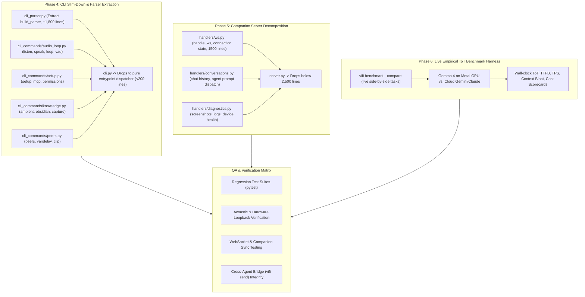

# VoiceFi Modularization & Architecture Refactor Roadmap

**Universal Voice Layer for AI Agents, MCP, and macOS**  
*Document Version:* 1.0.0  
*Status:* Active Architecture Document  
*Last Updated:* September 2026

---

## 🎯 Executive Overview & Motivation

VoiceFi originated as a high-velocity, full-duplex voice orchestration layer for AI coding agents (Google Antigravity, Claude Code, ChatGPT, Codex) and macOS. As features expanded—encompassing local Gemma 4 / LiteRT execution on Apple Silicon, Dynamic Island Cocoa HUDs, multi-Mac P2P clipboard/audio sync, speed-talking compression, and cross-agent dispatch—three core hotspot files grew into large monoliths:

1. `src/voicefi/cli.py` (~7,443 lines) — CLI argument definitions, command handlers, telemetry, audio feedback.
2. `src/voicefi/companion/server.py` (~5,020 lines) — WebSocket server, HTTP REST API, PWA static assets, STT/TTS routing, peer sync, and audio studio DSP pipelines.
3. `src/voicefi/integrations/conversations.py` (~1,540 lines) — Cross-process turn locking, debounce caches, agent transcript watchers, and auto-listen handoffs.

### Core Architectural Mandates
* **Zero Breaking Changes:** 100% backward compatibility for existing CLI commands, MCP tools, LaunchAgent daemons, and internal imports via re-export shims.
* **Test Invariance:** All regression test suites (`tests/test_local_benchmark.py`, `tests/test_claude_companion.py`, `tests/test_cli_telemetry.py`) must remain green across all intermediate steps.
* **Telemetry & Scout Transparency:** Utilize `vifi scout` and on-device LiteRT to audit tokens saved and inspect modules before refactoring.
* **Clean Separation of Concerns:** Pure business logic separated from presentation, protocol handling, and CLI parsing.

---

## 📊 Progress Scorecard & Completed Milestones

### Phase 1: Concurrency & Turn Locking Extraction (COMPLETED)
- **Target File:** `src/voicefi/integrations/conversations.py`
- **Extracted Module:** `src/voicefi/integrations/turn_lock.py` (~350 lines)
- **Key Capabilities Moved:**
  - Cross-process POSIX file locking (`fcntl.flock`) with `speech_turn_lock()`.
  - Atomic JSON disk persistence (`_atomic_write_json`) with guaranteed temporary file cleanup on exceptions.
  - Multi-process turn claiming with 3.0s debounce (`claim_turn`, `claim_active_conversation_turn`).
  - Mobile companion origin tracking and heartbeat monitoring.
  - Hardened process liveness detection (`is_pid_alive`) with `errno.EPERM` cross-user permissions handling.
- **Line Count Impact:** `conversations.py` reduced from 1,540 to 1,220 lines. Backward compatibility maintained via top-level star re-exports.

### Phase 2: Companion Server Mixin Decomposition (COMPLETED)
- **Target File:** `src/voicefi/companion/server.py`
- **Extracted Directory:** `src/voicefi/companion/handlers/`
  - `downloads.py`: Safe download path traversal verification (`target.is_relative_to(downloads_dir)`) and MIME categorization.
  - `peers.py` (`PeerHandlersMixin`): Multi-Mac P2P sync, clipboard exchange, and peer pairing.
  - `vault.py` (`VaultHandlersMixin`): Obsidian knowledge vault indexing, context querying, and note appending.
  - `audio.py` (`AudioHandlersMixin`): Dynamic STT transcription and TTS persona synthesis streaming with backward-compatible mock resolution (`_resolve_tts_engine`, `_resolve_stt_engine`).
  - `studio.py` (`StudioHandlersMixin`): Audio presets, sample trimming, DSP equalization, auto-transcription, and social reel production.
- **Line Count Impact:** `src/voicefi/companion/server.py` dropped from **5,020 down to 4,433 lines** (~600 lines removed).

### Phase 3: CLI Subcommand Modularization (COMPLETED)
- **Target File:** `src/voicefi/cli.py`
- **Extracted Directory:** `src/voicefi/cli_commands/`
  - `hooks.py`: `vifi hook` lifecycle, agent hook status inspection, enable/disable switches.
  - `server.py`: `vifi server`, `status`, `clean`, `autostart`, `stop-autostart`, `pause`, `resume`.
  - `troubleshoot.py`: `vifi troubleshoot`, `ping`, `hearing-test`, `feedback-loop`, `loopback`, `barge-in`.
  - `speed_talk.py`: `vifi speed-talk` acceleration engine, pause compression, and telemetry stats.
  - `memo.py`: `vifi memo` voice memo buffer and knowledge vault recording.
  - `voice.py`: `vifi voice`, `vifi clone`, `vifi voice download-ava` (~850 lines).
  - `media.py`: `vifi duel`, `sfx`, `fx`, `reel`, `trim` (~200 lines).
  - `live.py`: `vifi live` Gemini 3.8 Live studio & comedy (~65 lines).
  - `local.py`: `vifi local`, `scout`, `benchmark`, `spark` (~130 lines).
- **Line Count Impact:** `src/voicefi/cli.py` dropped from **7,443 down to 4,765 lines** (~2,678 lines removed).

### Phase 3.5: Local Model & Time-on-Task (ToT) Benchmark Engine (COMPLETED)
- **Target File:** `src/voicefi/local/benchmark.py`
- **Key Capabilities Added:**
  - Unified RAM vs. WAN network ingress measurement (`measure_unified_ram_ingress`, `measure_wan_ingress`).
  - Empirical multi-turn Time-on-Task comparison harness (`run_tot_comparison`).
  - Non-PII PostHog telemetry event emission (`tot_benchmark_comparison`).
  - Fast-path deterministic mocking in `tests/test_local_benchmark.py` (executes in 1.32s).

---

## 🗺️ Remaining Refactoring Phases



---

## 🧪 Comprehensive QA Verification Matrix

To execute extensive QA on VoiceFi refactorings across sessions:

### 1. Automated Test Suites
Run all core test suites inside the virtual environment:
```bash
./.venv/bin/pytest tests/test_local_benchmark.py tests/test_claude_companion.py tests/test_cli_telemetry.py -v
```
*Expected: 27 passed in <5 seconds.*

### 2. CLI Dispatch Integrity
Verify subcommands execute without `AttributeError` or missing parser arguments:
```bash
vifi --help
vifi voice list
vifi sfx list
vifi live --help
vifi local status
vifi benchmark --history
vifi speed-talk stats
vifi troubleshoot --json
```

### 3. Audio & Acoustic Loopback Sanity
Verify TTS synthesis, microphone capture, and CoreAudio routing:
```bash
# Audition persona playback
vifi voice test "Viv" -t "Acoustic audio verification test."

# Test silent TTFB latency benchmarks
vifi ping Viv

# Test simultaneous speak and listen loopback
vifi feedback-loop

# Room acoustic reception match
vifi hearing-test
```

### 4. Background Server & WebSocket Daemon
```bash
# Verify LaunchAgent port listener
vifi server status

# Clean restart
vifi clean --all && vifi restart

# Verify WebSocket companion hub
curl -s http://localhost:5141/health | jq .
```

### 5. Cross-Agent Bridge Verification
```bash
# Verify vifi send routing to Antigravity / Claude
vifi send "Sanity ping from VoiceFi QA harness" --to antigravity --dry-run
```

---

## 📋 Session Handoff & How to Carry Forward

When continuing this refactoring in a fresh conversation, provide this prompt:

> **New Conversation Prompt:**
> "We are continuing the VoiceFi Modularization Refactor tracked in `docs/MODULARIZATION_REFACTOR_ROADMAP.md`. 
> Review that document, verify current git status, and run the test suite `./.venv/bin/pytest tests/test_local_benchmark.py tests/test_claude_companion.py tests/test_cli_telemetry.py`.
> Proceed with [Phase 4: CLI Slim-Down & Parser Extraction] OR [Extensive QA Matrix]."
