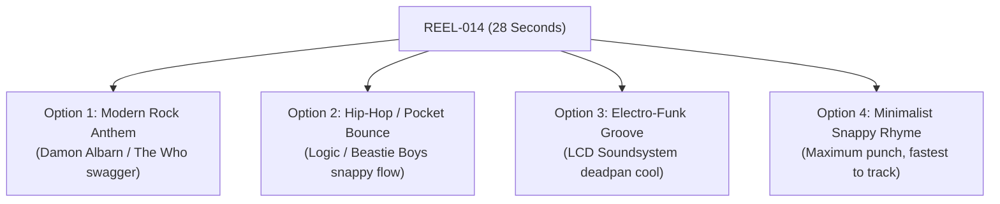

# 🎙️ REEL-014: Rhyming Song Options & Lyrical Lead Sheet
### *The Science of the Glass Wall (28-Second Vertical Reel)*

> **Core Scientific Message**: 
> 47-second screen switching $\rightarrow$ 23-minute focus collapse $\rightarrow$ Evolved for sound, not screens $\rightarrow$ Parallel vision + sound $\rightarrow$ Hands-free, 5G, zero friction $\rightarrow$ Keep your focus free $\rightarrow$ 💥 **`YEEEEAAAAAH!`**

---

## 🎵 Why This Rocks at 118 BPM: The Math of the 28-Second Reel

At **118 BPM**, each bar of 4/4 music is **2.034 seconds**:
* **2 Bars = 4.07 seconds** $\approx$ **Exactly 1 Video Scene Cut!**
* Every visual clip change in the video lands precisely on a 2-bar downbeat:

```
Clip 0 [0.0s - 4.0s]   | Bar 1 - 2   | Scene 1: Developer coding frantically at desk
Clip 1 [4.0s - 8.0s]   | Bar 3 - 4   | Scene 2: Exhausted face looking through glass
Clip 2 [8.0s - 12.0s]  | Bar 5 - 6   | Scene 3: Matrix green code rain dissolve
Clip 3 [12.0s - 16.0s] | Bar 7 - 8   | Scene 4: Rubbing temples / hi-hat groove enters
Clip 4 [16.0s - 20.0s] | Bar 9 - 10  | Scene 5: Smiling at desk in sunlight
Clip 5 [20.0s - 24.0s] | Bar 11 - 12 | Scene 6: Walking freely in park with iced latte
Clip 6 [24.0s - 28.0s] | Bar 13 - 14 | Scene 7: Caruso sunglasses drop + Daltrey scream!
```

---

## 🧭 The 4 Rhyming Options



---

## 🎸 Option 1: Modern Rock Anthem *(The Who meets Gorillaz)*
* **Vibe**: Rhythmic, swaggering rock cadence. Rides the bubbling VCS3 organ and punches hard on the rhymes.
* **Flow**: AABB structure with internal rhymes that land right on the snare backbeats.

### Lead Sheet & Snare-Drop Notation (`💥` = Snare Drum Hit):

#### [0:00.35 – 0:04.80] — Bar 1 & 2 (Clips 0 & 1):
```text
Forty-seven seconds till we switch another SCREEN,
                                            💥
Drowning in the clutter of a digital MACHINE.
                                      💥
```

#### [0:05.20 – 0:11.95] — Bar 3, 4, 5 & 6 (Clips 1, 2 & Matrix Dissolve):
```text
Twenty-three minutes just to find flow STATE,
                                        💥
One visual ping and you wipe that SLATE.
                                   💥
(dramatic breathing pause as code rain dissolves...)
Flow state... is broken.
```

#### [0:12.20 – 0:15.20] — Bar 7 & 8 (Clip 3 · Viv entrance over hi-hats):
```text
Two hundred thousand years walking on the GREEN:
                                           💥
We evolved for SOUND, not screens.
                 💥
```

#### [0:15.80 – 0:21.20] — Bar 9 & 10 (Clips 4 & 5 · Jake with band groove):
```text
Your brain handles sound in parallel with VISION,
                                          💥
Zero lag, zero drag, laser-cut PRECISION!
                                💥
That’s hands-free, 5G, zero FRICTION,
                             💥
Free your eyes from the screen ADDICTION!
                               💥
```

#### [0:22.00 – 0:24.00] — Bar 11 & 12 (Clip 5 · Emily before cut):
```text
Keep your focus...
(half-beat pause)
...FREE!
   💥 (24.00s video cut to sunset!)
```

#### [0:24.00 – 0:28.00] — Bar 13 & 14 (Clip 6 · Outro Stinger):
*(David Caruso sunset sunglasses removal $\rightarrow$ Keith Moon drum roll $\rightarrow$ 26.50s)*  
🔥 **`YEEEEEEEEEEAAAAAAAAAAAH!`** *(Roger Daltrey scream + colossal A-major power chord)*

---

## 🎤 Option 2: The Hip-Hop / Pocket Bounce *(Logic meets Mac Miller)*
* **Vibe**: Snappy, effortless hip-hop swagger. High bounce, conversational confidence, syncopated rolls.
* **Flow**: Multi-syllabic rhymes (**SCREEN / SCENE**, **STATE / LATE / SLATE**, **VISION / PRECISION / DECISION**).

### Lead Sheet & Snare-Drop Notation:

#### [0:00.35 – 0:04.80] — Clips 0 & 1:
```text
Forty-seven seconds, click and switch the whole SCENE,
                                                   💥
Lost in thirty tabs behind a glass MACHINE.
                                     💥
```

#### [0:05.20 – 0:11.95] — Clips 1 & 2:
```text
Twenty-three minutes just to build flow STATE,
                                        💥
One little slack ping, twenty minutes LATE.
                                      💥
(pause... Matrix dissolve)
Flow state... shattered.
```

#### [0:12.20 – 0:15.20] — Clip 3 (Viv):
```text
Forget the blue light flickering on BEAMS:
                                      💥
We evolved for sound, not screens.
                 💥
```

#### [0:15.80 – 0:21.20] — Clips 4 & 5 (Jake):
```text
Brain handles sound while you keep full VISION,
                                        💥
Walking in the park with a smooth DECISION.
                                  💥
That's hands-free, 5G, zero FRICTION,
                             💥
Living in the flow, no restriction.
                        💥
```

#### [0:22.00 – 0:24.00] — Clip 5 (Emily):
```text
Break the glass... keep your focus...
(pause)
...FREE!
   💥
```

#### [0:24.00 – 0:28.00] — Outro:
🔥 **`YEEEEEEEEEEAAAAAAAAAAAH!`**

---

## 🕶️ Option 3: The Electro-Funk Groove *(LCD Soundsystem meets Daft Punk)*
* **Vibe**: Cool, deadpan, rhythmic modern tech-futurism. Every word lands with razor-sharp syncopation.
* **Flow**: Tight rhythmic spacing with call-and-response feeling.

### Lead Sheet & Snare-Drop Notation:

#### [0:00.35 – 0:04.80] — Clips 0 & 1:
```text
Forty-seven seconds and you switch your SCREEN,
                                            💥
Living in the flicker of a glass ROUTINE.
                                  💥
```

#### [0:05.20 – 0:11.95] — Clips 1 & 2:
```text
Twenty-three minutes to ignite flow STATE,
                                      💥
Visual overload and you seal your FATE.
                                  💥
(pause... code dissolves)
Flow state... is broken.
```

#### [0:12.20 – 0:15.20] — Clip 3 (Viv):
```text
Cut through the fog of the digital STREAMS:
                                    💥
We evolved for sound, not screens.
                 💥
```

#### [0:15.80 – 0:21.20] — Clips 4 & 5 (Jake):
```text
Audio in parallel with your VISION,
                            💥
Zero screen drag, pure PRECISION.
                       💥
Hands-free, 5G, zero FRICTION,
                     💥
Coding on the go is a sweet ADDICTION.
                            💥
```

#### [0:22.00 – 0:24.00] — Clip 5 (Emily):
```text
Step into the light... keep your focus...
(pause)
...FREE!
   💥
```

#### [0:24.00 – 0:28.00] — Outro:
🔥 **`YEEEEEEEEEEAAAAAAAAAAAH!`**

---

## ⚡ Option 4: The Minimalist Snappy Rhyme *(Fastest & Cleanest to Track)*
* **Vibe**: Direct, ultra-punchy, fewest words, 100% natural speech pocket. Zero tongue-twisters.
* **Flow**: Ideal if you want to record the whole take in GarageBand in under 2 minutes with zero retakes.

### Lead Sheet & Snare-Drop Notation:

#### [0:00.35 – 0:04.80] — Clips 0 & 1:
```text
Every forty-seven seconds, switch another SCREEN,
                                            💥
Trapped behind the glass of an endless MACHINE.
                                       💥
```

#### [0:05.20 – 0:11.95] — Clips 1 & 2:
```text
Twenty-three minutes just to find flow STATE,
                                        💥
One interruption wipes the whole SLATE.
                                 💥
(pause...)
Flow state... is broken.
```

#### [0:12.20 – 0:15.20] — Clip 3 (Viv):
```text
Listen to your biology, know what it MEANS:
                                      💥
We evolved for sound, not screens.
                 💥
```

#### [0:15.80 – 0:21.20] — Clips 4 & 5 (Jake):
```text
Your brain handles sound in parallel with VISION,
                                          💥
Hands-free, 5G, zero FRICTION.
                     💥
Live in the flow, no visual RESTRICTION!
                             💥
```

#### [0:22.00 – 0:24.00] — Clip 5 (Emily):
```text
Keep your focus...
(beat)
...FREE!
   💥
```

#### [0:24.00 – 0:28.00] — Outro:
🔥 **`YEEEEEEEEEEAAAAAAAAAAAH!`**

---

## 📊 Side-by-Side Comparison: Current vs. Rhyming Options

| Segment / Timestamp | Current Script (Prose) | Option 1 (Rock Anthem) | Option 2 (Hip-Hop Pocket) | Option 4 (Minimalist Rhyme) |
| :--- | :--- | :--- | :--- | :--- |
| **Line 1 (0:00 - 0:05)** | *"Research shows that on computers we switch screens every 47 seconds."* | *"Forty-seven seconds till we switch another **SCREEN**, / Drowning in the clutter of a digital **MACHINE**."* | *"Forty-seven seconds, click and switch the whole **SCENE**, / Lost in thirty tabs behind a glass **MACHINE**."* | *"Every forty-seven seconds, switch another **SCREEN**, / Trapped behind the glass of an endless **MACHINE**."* |
| **Line 2 (0:05 - 0:12)** | *"Deep focus takes 23 minutes to reach. Flow state... is broken."* | *"Twenty-three minutes just to find flow **STATE**, / One visual ping and you wipe that **SLATE**... Flow state... is broken."* | *"Twenty-three minutes just to build flow **STATE**, / One little slack ping, twenty minutes **LATE**... Flow state... shattered."* | *"Twenty-three minutes just to find flow **STATE**, / One interruption wipes the whole **SLATE**... Flow state... is broken."* |
| **Line 3 (0:12 - 0:15)** | *"We evolved for sound, not screens."* | *"Two hundred thousand years walking on the **GREEN**: / We evolved for sound, not screens."* | *"Forget the blue light flickering on **BEAMS**: / We evolved for sound, not screens."* | *"Listen to your biology, know what it **MEANS**: / We evolved for sound, not screens."* |
| **Line 4 (0:15 - 0:21)** | *"Your brain handles sound in parallel with vision. That's hands-free, 5G, zero friction."* | *"Your brain handles sound in parallel with **VISION**, / Zero lag, zero drag, laser-cut **PRECISION**! / That’s hands-free, 5G, zero **FRICTION**, / Free your eyes from the screen **ADDICTION**!"* | *"Brain handles sound while you keep full **VISION**, / Walking in the park with a smooth **DECISION**. / That's hands-free, 5G, zero **FRICTION**, / Living in the flow, no restriction."* | *"Your brain handles sound in parallel with **VISION**, / Hands-free, 5G, zero **FRICTION**. / Live in the flow, no visual **RESTRICTION**!"* |
| **Line 5 (0:21 - 0:24)** | *"Keep your focus... free."* | *"Keep your focus... [beat] ...**FREE!**"* | *"Break the glass... keep your focus... [beat] ...**FREE!**"* | *"Keep your focus... [beat] ...**FREE!**"* |
| **Outro (0:24 - 0:28)** | Sunglasses drop + Scream | Sunglasses drop + Scream | Sunglasses drop + Scream | Sunglasses drop + Scream |

---

## 🎛️ GarageBand Vocal Tracking Tips for Jake

1. **Riding the 118 BPM Snare**:
   - The snare hits on beats **2 and 4** of every bar.
   - When you say the rhyming words (**SCREEN**, **MACHINE**, **STATE**, **SLATE**, **VISION**, **PRECISION**, **FRICTION**), let them hit with the snare. That creates that irresistible "radio head-nod" effect.
2. **The 12.00s Matrix Dissolve**:
   - Don't rush Line 2! Say *"Twenty-three minutes just to find flow state, one visual ping and you wipe that slate..."*, then **pause for 1.5 seconds**. Let Keith Moon's drum fill roll underneath. Then drop *"Flow state... is broken"* right at `11.95s` as the green code turns to black.
3. **The Viv & Emily Call-and-Response**:
   - You can either record **all lines yourself**, OR record just Jake's lines (Lines 1, 2, 4) and let Viv and Emily's AI neural voices handle Line 3 and Line 5 for that futuristic human-agent duet!
4. **Vocal Tone & Mic Technique**:
   - **Lines 1 & 2**: Slightly closer to the mic (proximity effect, intimate, confessional frustration).
   - **Line 4**: Lean back 2 inches, open up your chest, confident swagger, smiling into the mic as the sun hits.
   - **Export**: Bounce dry audio to `~/Downloads/` (e.g. `jake_vocal_take_01.wav`), and we'll immediately forced-align and render the master video!
