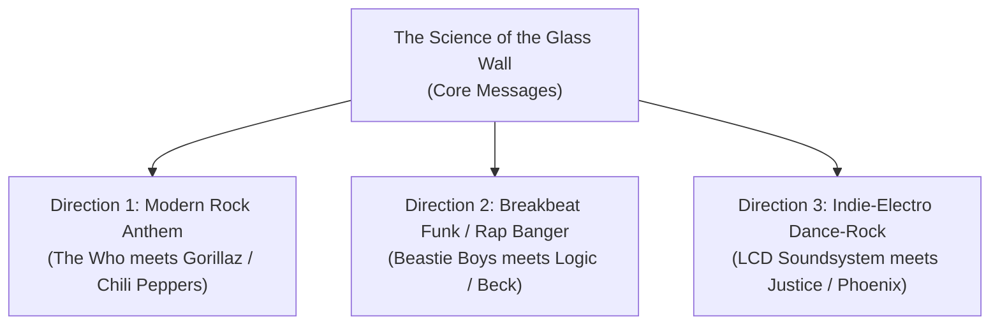

# 🎸 The Science of the Glass Wall — Pure Song Form Directions

> *"Research shows we switch screens every 47 seconds. Deep focus takes 23 minutes to reach. We evolved for sound, not screens. Your brain handles sound in parallel with vision. That's hands-free, 5G, zero friction. Keep your focus free."*

---

## 🎯 Executive Vision: From 28-Second Stinger to Full Song

The 28-second reel captured lightning in a bottle: the universal cognitive pain of modern screen fatigue paired with Pete Townshend’s iconic bubbling EMS VCS3 organ synthesizer and the legendary *CSI: Miami* David Caruso / Roger Daltrey **`YEEEEAAAAAH!`** scream climax.

Taking this into **pure song form** expands the narrative into a full 3-minute anthem without losing an ounce of the core message or the meme-level virality. Every developer, designer, knowledge worker, and screen-exhausted human on Earth relates to the feeling of staring through the "glass wall."

This document outlines **3 distinct musical directions**, complete **song arrangements**, **lead sheet lyrics with snare-drop notation**, and a **GarageBand tracking blueprint**.

---

## 🧭 The 3 Musical Directions



---

### Direction 1: The Modern Rock Anthem *(The Who meets Gorillaz & Red Hot Chili Peppers)*
* **Tempo**: 118 – 122 BPM (Driving rock pulse)
* **Instrumentation**: 
  - Pete Townshend bubbling VCS3 organ arpeggio running continuous 16th notes.
  - John Entwistle / Flea style punchy, melodic roundwound bassline.
  - Keith Moon energetic live drum kit with rolling toms and aggressive open hi-hats.
  - Pete Townshend chiming acoustic 12-string guitar in the verses, exploding into roaring Gibson Les Paul / Hiwatt power chords on the chorus and outro.
* **Vocal Style**: Rhythmic, urgent spoken-sung verses (like Damon Albarn / Anthony Kiedis), rising into a soaring, anthemic melodic vocal chorus, and climaxing with the authentic rock scream.
* **Vibe**: Triumphant, organic, explosive rock liberation from digital screen slavery.

---

### Direction 2: The Breakbeat Funk / Rap Banger *(Beastie Boys meets Logic & Beck)*
* **Tempo**: 92 – 96 BPM (Head-nodding breakbeat swing)
* **Instrumentation**:
  - The Pete Townshend organ arpeggio chopped and looped as a funky hip-hop sample.
  - Chunky acoustic drum break (think "When the Levee Breaks" or classic 90s boom-bap).
  - Heavy 808 sub-bass under live funky electric bass.
  - Scratch turntable cuts (*"47 seconds... 23 minutes..."* sample scratches).
* **Vocal Style**: Rapid-fire, witty, swagger-infused conversational rap verses (Jake), trading bars with soulful sung female backing ad-libs (Viv & Emily).
* **Vibe**: Street-smart, high-energy, infectious developer swagger. You're strutting through the park sipping an iced latte while your AI agents write production code in your ears.

---

### Direction 3: Indie-Electro Dance-Rock *(LCD Soundsystem meets Justice & Daft Punk)*
* **Tempo**: 124 – 128 BPM (Four-on-the-floor driving club pulse)
* **Instrumentation**:
  - Pumping sidechain compression on the bubbling synth organ.
  - Driving four-on-the-floor kick drum and crisp handclaps.
  - Distorted electro-bass synth (think Justice's *"D.A.N.C.E."* or Daft Punk's *"Robot Rock"*).
  - Neuro-funk guitar skank on the 2 and 4.
* **Vocal Style**: Deadpan, cool, rhythmic narration in the verses (like James Murphy in *"Losing My Edge"*), building into an euphoric, stadium-sized choir hook.
* **Vibe**: Chic, modern tech-futurism. Breaking out of the dark neon coding dungeon into broad daylight.

---

## 🗺️ Master Song Architecture (3:00 Duration)

```
[0:00 - 0:16]  INTRO (8 Bars)
               Keyboard typing clicks fade into solo bubbling VCS3 synth organ arpeggio
               Sub-bass heartbeat pulse builds

[0:16 - 0:48]  VERSE 1 (16 Bars): "The 47-Second Trap"
               Switching tabs, screen fatigue, cognitive residue, 23 minutes lost

[0:48 - 1:04]  PRE-CHORUS (8 Bars): "Acoustic Biology"
               Screens are 50 years old, vocal cords are 200,000 years old
               Bassline ramps up, hi-hats open

[1:04 - 1:28]  CHORUS (12 Bars): "Tear Down the Glass Wall"
               Anthemic, soaring vocal hook: Hands-free, zero friction

[1:28 - 2:00]  VERSE 2 (16 Bars): "The 5G Park Walk / Parallel Flow"
               Reclining at the desk, touching the wireless earbud, stepping outside
               Processing sound in parallel with vision while sipping coffee

[2:00 - 2:24]  CHORUS (12 Bars): "Tear Down the Glass Wall"
               Full band, live drums, soaring vocal harmonies

[2:24 - 2:40]  BRIDGE / BREAKDOWN (8 Bars): "The Matrix Dissolve"
               Vocals drop out, digital code rain fades into solo synth pulse
               Keith Moon thunderous drum roll starts building from a whisper to a roar

[2:40 - 3:00]  OUTRO / FINALE (8 Bars): "The Caruso Sunglasses Stinger"
               Keith Moon drum fill hits 100% volume
               Lead vocal: "Keep your focus... [beat pause] ...FREE!"
               💥 2:48: Roger Daltrey "YEEEEEEEEEEAAAAAAAAAAAH!" + Colossal Power Chords
               Epic rock guitar outro into cut to black
```

---

## 📝 Complete Song Lyrics & Snare-Drop Lead Sheet

*Notation Guide: The **`💥`** indicates the exact snare drum backbeat where the stressed launchpad syllable lands.*

### [Intro: 0:00 – 0:16]
*(Sound effect: Rapid mechanical keyboard clatter, fading into Pete Townshend's bubbling VCS3 organ pulse)*  
*(Spoken ad-lib over the synth pulse)*:  
> *"Look at your screen right now... Forty-seven seconds. Twenty-three minutes. Watch this."*

---

### [Verse 1: 0:16 – 0:48] — *The 47-Second Trap*
```text
Staring through the monitor, eyes turn RED,
                                     💥
Forty-seven seconds till I switch tabs INSTEAD.
                                       💥
Cognitive residue, swimming in the HAZE,
                                   💥
Lost in thirty windows of a digital MAZE.
                                   💥

Twenty-three minutes just to find flow STATE,
                                      💥
One slack ping and you wipe that SLATE.
                                  💥
Overloaded buffers in the visual CORTEZ,
                                   💥
Trapped behind the glass while the whole world WRECKS.
                                             💥
```

---

### [Pre-Chorus: 0:48 – 1:04] — *Acoustic Biology*
*(Half-sung, drums kick into a steady four-on-the-floor groove)*
```text
Writing is five thousand years of HUMAN CHAT,
                                      💥
Screens are only fifty—what you think of THAT?
                                         💥
Two hundred thousand years walking in the WILD,
                                          💥
We evolved for SOUND, not screens, my CHILD!
                       💥
```

---

### [Chorus: 1:04 – 1:28] — *Tear Down the Glass Wall*
*(Full band explodes, soaring melodic hook with vocal harmonies)*
```text
Tear down the glass wall, step into the LIGHT!
                           💥             💥
Your ears can hear the day while your eyes catch SIGHT!
                                                💥
Your brain handles sound in parallel with VISION,
                                          💥
Zero lag, zero drag, laser-cut PRECISION!
                                  💥

That’s hands-free, 5G, zero FRICTION,
                            💥
Living in the flow, no visual RESTRICTION!
                              💥
Keep your focus FREE!
                💥
```

---

### [Verse 2: 1:28 – 2:00] — *The 5G Park Walk & Parallel Flow*
*(Laid-back, confident strut, Keith Moon groove)*
```text
Push back the desk chair, stepping out the DOOR,
                                           💥
I don’t even look down at a laptop no MORE.
                                      💥
Walking through the park with an iced oat LATTE,
                                         💥
Agent in my ear, moving smart, moving JAUNTY.
                                        💥

Claude on the left, Antigravity on the RIGHT,
                                       💥
Debugging the backend without losing SIGHT.
                                      💥
Zero screen flicker, zero clipboard TRAPS,
                                      💥
Parallel processing while I’m taking LAPS!
                                      💥
```

---

### [Chorus: 2:00 – 2:24] — *Tear Down the Glass Wall*
*(Huge stadium sound, backup vocals soaring)*
```text
Tear down the glass wall, step into the LIGHT!
                           💥             💥
Your ears can hear the day while your eyes catch SIGHT!
                                                💥
Your brain handles sound in parallel with VISION,
                                          💥
Zero lag, zero drag, laser-cut PRECISION!
                                  💥

That’s hands-free, 5G, zero FRICTION,
                            💥
Living in the flow, no visual RESTRICTION!
                              💥
Keep your focus FREE!
                💥
```

---

### [Bridge / Breakdown: 2:24 – 2:40] — *The Matrix Dissolve*
*(The band suddenly drops out. Only the solo bubbling Lowrey/VCS3 synth arpeggio remains. In the distance, Keith Moon's thunderous tom-tom drum roll begins rolling and swelling).*

*(Spoken deadpan)*:
> *"Deep focus takes twenty-three minutes to reach..."*  
> *(2-second dramatic silence as Keith's drums build)*  
> *"...Flow state... is broken."*

---

### [Climax & Outro: 2:40 – 3:00] — *The Caruso Sunglasses Finale*
*(Keith Moon's drum roll reaches 100% full thunder)*  
*(Slow, confident spoken delivery)*:
```text
"Keep your focus...
 (one beat pause)
 ...FREE!"
```

*(t = 2:48 — Deadpan camera lock)*:  
🔥 **`YEEEEEEEEEEAAAAAAAAAAAHHHHHHHHHHHHHHHHH!`**  
*(Pete Townshend roars in with the colossal A-major power chord, dual guitars screaming, crash cymbals ringing out to infinity!)*

---

## 🎛️ GarageBand & Logic Pro Production Blueprint

To track and produce this song in GarageBand right now:

### 1. Track Layout & Stems
| Track # | Name | Source / Plug-in | Pan | Processing / FX |
| :--- | :--- | :--- | :--- | :--- |
| **Track 1** | **Synth Arpeggio** | Pete Townshend VCS3 Stem (`01_MUSIC_BED`) | Center | Tape saturation, high-pass @ 180Hz |
| **Track 2** | **Acoustic Drums** | GarageBand "Liverpool" kit (Keith Moon style) | Stereo | Bus compressor (punchy attack, fast release) |
| **Track 3** | **Bass Guitar** | "Classic Rock Bass" / P-Bass with pick | Center | Mild overdrive, compressed at 4:1 |
| **Track 4** | **Rhythm Guitar** | Acoustic 12-string / Crunch Electric | Wide L/R | Stereo spread, scooped mids |
| **Track 5** | **Lead Vocals (Jake)** | Studio Condenser / Shure SM7B | Center | Optical compressor, subtle plate reverb |
| **Track 6** | **Harmony Vocals (Viv/Emily)** | EdgeTTS / AI Persona vocal stems | Wide ±45% | High-shelf sheen, chorusing |
| **Track 7** | **The Caruso Climax** | Roger Daltrey Scream & Townshend Chord | Center | Full blast, zero ducking, maximum impact |

### 2. Mix Dynamics & Ducking
* **Verses**: Keep the bubbling synth at ~`-12dB` so the vocal lyrics cut through effortlessly with punchy consonants (**P, B, T, K**).
* **Pre-Chorus**: Raise drum velocity and open the hi-hats.
* **Chorus**: Guitars double-tracked wide left and right, full bass presence.
* **Outro Stinger (2:40 – 3:00)**: Everything ducks down for the 1-beat silence before *"FREE"*, then unleashes **100% master headroom** the millisecond the scream hits at `2:48`!
