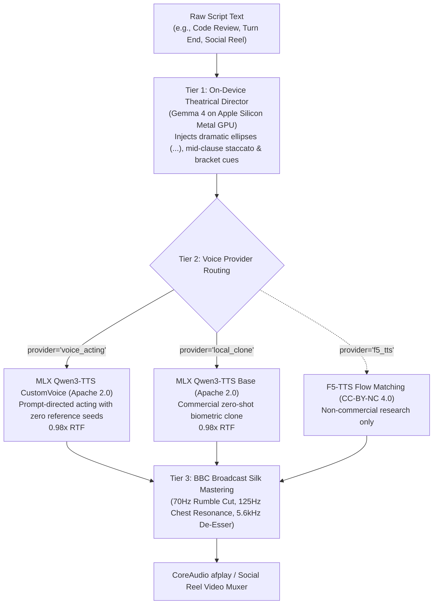

# 🎭 Voice Acting & Local Expression Architecture — VoiceFi™

> **Status:** Production / Active  
> **Engine:** MLX Discrete Neural Audio Codec (`mlx-audio`) + F5-TTS Multi-Emotion Flow Matching  
> **Hardware Target:** Apple Silicon Metal GPU (M-Series Unified Memory)  
> **Inference Benchmark:** **0.98x Real-Time Factor (RTF)** • ~3.3GB Peak VRAM  
> **On-Device Director:** Local Gemma 4 via LiteRT / Ollama  

---

## 🧭 Overview & The Architectural Paradigm Shift

Historically, local text-to-speech (TTS) engines have suffered from the **"GPS Monotone" problem**:
* **Gen 1 (Phonemic Concatenation / StyleTTS / Kokoro-82M):** Predicts static mel-spectrograms from phonemes. High clarity, but zero semantic subtext, sarcasm, or theatrical volume swings.
* **Gen 2 (Diffusion Timbre Cloning / F5-TTS):** Accurately clones biometric speaker timbre, but is emotionally trapped in the exact acoustic energy of its 10-second reference audio seed. (If the seed is calm, it speaks screamed lines with a calm voice).
* **Gen 3 (Autoregressive Discrete Neural Audio Codecs / Voice Acting):** Audio is quantized into discrete acoustic tokens. A language transformer interprets emotional subtext, breath intakes, and natural language performance directions (`--instruct`), delivering an authentic **acting performance** rather than mere vocal sound.

```
┌────────────────────────────────────────────────────────────────────────────────────────┐
│                              The 3 Generations of Voice AI                             │
├────────────────────────────────┬───────────────────────────┬───────────────────────────┤
│ Gen 1: Phonemic Predictor      │ Gen 2: Timbre Cloner      │ Gen 3: Voice Acting       │
│ (Kokoro-82M / Piper)           │ (F5-TTS Flow Matching)    │ (MLX Discrete Codec LLM)  │
├────────────────────────────────┼───────────────────────────┼───────────────────────────┤
│ Text -> Phonemes -> Spectrogram│ Diffusion on audio frames │ Autoregressive Codec LLM  │
│ 82M parameters                 │ 300M parameters           │ 0.6B - 1.7B parameters    │
│ ❌ Zero semantic comprehension │ ❌ Emotionally locked to  │ ✅ Shouts, smirks, whispers│
│ ❌ Cannot act or shout         │    single reference seed  │ ✅ Directable with text   │
└────────────────────────────────┴───────────────────────────┴───────────────────────────┘
```

---

## 🏛️ System Architecture



---

## 🎙️ Canonical Persona Presets

VoiceFi comes pre-configured with 6 theatrical character profiles in [`src/voicefi/tts/voice_acting.py`](../src/voicefi/tts/voice_acting.py):

| Persona Key | Base Actor | Default Acting Directive (`--instruct`) | Character Archetype |
| :--- | :--- | :--- | :--- |
| **`drill_sergeant`** | `ryan` | *"Shouting aggressively with fierce military drill sergeant discipline, barking commands, loud projection, rapid cadence, and zero hesitation."* | Boot camp drill instructor |
| **`deadpan_ironist`** | `vivian` | *"Speaking with deadpan condescension, flat monotone smirk, weary software engineer chuckling with dry Elizabethan irony and trailing vocal fry."* | Weary senior architect |
| **`game_show_host`** | `aiden` | *"Extravagant high-energy 1980s television game-show host holding a golden microphone on stage with explosive booming showmanship and glossy enthusiasm."* | Retro TV showman |
| **`shakespearean`** | `eric` | *"Elizabethan Shakespearean classical stage actor performing a high-stakes tragedy with immense theatrical gravitas, trembling pathos, and dark poetic weight."* | Classical stage tragedian |
| **`conspiratorial_insider`** | `sohee` | *"Underground hacker whispering forbidden operating system secrets in a dimly lit alley with hushed urgent paranoia, conspiratorial intimacy, and nervous tension."* | Paranoid alleyway hacker |
| **`christopher_walken`** | `sample_cowbell_snl` / `eric` | *"Idiosyncratic staccato rhythm, unexpected dramatic pauses, sudden pitch spikes, deadpan comedic intensity."* | Iconic eccentric actor |

---

## 🔔 Christopher Walken Turn-Completion Voice Acting

Antigravity turn completions use Christopher Walken's iconic cadence with two interlocking systems:

### 1. Staccato Cadence Director ([`TheatricalDirector.direct_walken_cadence`](../src/voicefi/tts/director.py))
Automatically parses turn summaries into erratic Walken phrasing:
* Injects mid-clause dramatic ellipses (`...`).
* Replaces flat starts with signature prefixes (*"Look..."*, *"Listen..."*, *"Guess what?..."*).
* Example:
  * **Input:** `"I fixed the issue in the code and all tests are passing."`
  * **Directed:** `"Guess what?... I fixed the issue in the... code and all tests are passing. Beautiful."`

### 2. SNL Cowbell Acoustic Seed
Configured in `~/.voicefi/config.yaml`:
```yaml
tts:
  cloning_engine: qwen             # Uses Apache 2.0 MLX Qwen3-TTS Base
  provider: local_clone
  voice: christopher_walken
  f5_ref_audio: ~/.voicefi/cloned_voices/christopher_walken/samples/sample_cowbell_snl.wav
  f5_ref_text: "Guess what? I got a fever, and the only prescription is more cowbell."
```

---

## ⚡ Speech-to-Speech (STS) Video Dubbing Without Re-Rendering

One of the most powerful implications of decoupled voice acting:
* **The Problem with Video Lip-Sync Models (Wav2Lip, LivePortrait):** Re-painting mouth pixels introduces blurry artifacts, distorted teeth, and slow GPU rendering.
* **The Speech-to-Speech (STS) Solution:**
  1. Extract the original audio track from an existing video (e.g., Trump speaking).
  2. Run **Speech-to-Speech Timbre Swapping** into another voice (e.g., Barack Obama or Christopher Walken).
  3. STS preserves **100% of the syllable lengths, pauses, volume envelopes, and phonetic boundaries**.
  4. Mux the new audio track back onto the original video:
     ```bash
     ffmpeg -i original.mp4 -i converted_voice.wav -c:v copy -map 0:v:0 -map 1:a:0 dubbed.mp4
     ```
  5. **Result:** The video frames are untouched, the export takes **0.3 seconds**, and the lips are perfectly locked with zero distortion!

---

## 🛠️ CLI Usage & Quick Reference

```bash
# 1. Voice Acting with Preset Personas
vifi speak "Attention! Drop and give me twenty right now!" -p voice_acting -v drill_sergeant
vifi speak "If you guessed B, congratulations." -p voice_acting -v deadpan_ironist
vifi speak "For 500 points! What is your last resort command?" -p voice_acting -v game_show_host

# 2. Custom Ad-Hoc Theatrical Direction
vifi speak "Avast ye! The starboard database be taking on water!" \
  -p voice_acting \
  --instruct "Grizzled 17th-century pirate captain barking frantically in a sea storm"

# 3. Christopher Walken Turn Audition
vifi speak "Your production database... it has a fever!" -v christopher_walken
```

---

## 📦 Python SDK Usage

```python
from voicefi.tts.voice_acting import VoiceActingTTS
from voicefi.config import load_config

# Initialize local MLX Voice Acting engine
actor = VoiceActingTTS(
    persona_name="drill_sergeant",
    instruct="Shouting aggressively with intense military discipline",
    speed=1.1,
)

# Synthesize directly to broadcast-mastered WAV
actor.speak_to_file("Drop and give me twenty right now!", "/tmp/drill_sergeant.wav")

# Or speak immediately on macOS CoreAudio
actor.speak("Listen up recruits!")
```

---

## ⚖️ Architectural Decision Matrix: When to Use Which Speech Engine

VoiceFi provides three distinct tiers of voice synthesis. Knowing when to escalate from utility reading to theatrical acting is essential:

| Speech Tier | Engine / Provider | Core Archetype | Strengths & Capabilities | Best Use Cases | Cost / Constraints |
| :--- | :--- | :--- | :--- | :--- | :--- |
| **Tier 1: Multimodal Theatrical Stage** | **Gemini 3.8 Live** (`gemini-3.8-live` Native Audio) | **The Improv Acting Troupe** (*"The Three Stooges"*) | Generates direct acoustic tokens in model latent space. Performs gasps, laughter, shouting, comedic timing, voice squeaks, and bickering banter. | Viral comedy shorts, Three Stooges roasts, AI rap battles, interactive live voice roleplay. | Cloud API dependency; token metered billing; requires WAN. |
| **Tier 2: On-Device Voice Acting & Clones** | **MLX Qwen3-TTS** (Apache 2.0) & **F5-TTS** (CC-BY-NC 4.0 Research) | **The Method Actor** (*"Walken, Attenborough, Drill Sergeant"*) | On-device autoregressive codec LLM (Apache 2.0 commercial) and diffusion flow matching (research mode) on Apple Silicon GPU. Directable with `--instruct` prompts and biometric audio reference seeds. | Custom founder cloned voices, character monologues, offline theatrical delivery. | Requires ~3.3GB unified RAM on Apple Silicon Metal GPU; 0.98x RTF. |
| **Tier 3: Autonomous Content Factory Stage 2** | **Edge-TTS / CoreAudio** with 48kHz PCM Stitching | **The Professional Broadcast Announcers** (*"Viv & Jake"*) | Rapid multi-speaker turn synthesis, acoustic tag stripping, 140ms conversational gaps, and automatic sidechain music ducking. | Overnight soak runs (4,000+ jobs), technical change recaps, customer briefings, automated batch reels. | $0 cloud cost; 100% reliable; fast (~8s per 30s reel); clean announcer delivery without slapstick physical acting. |
