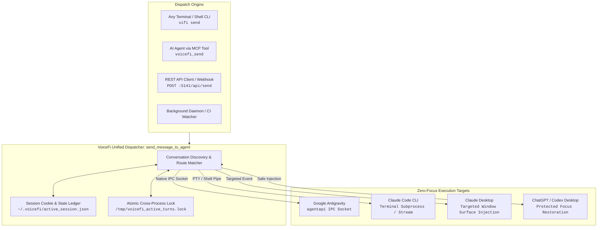

# 🔒 Internal Specification: Zero-Focus Cross-Agent IPC & Prompt Dispatch Engine (`vifi send`)

**Document ID**: SPEC-VIFI-IPC-2026-01  
**Classification**: Internal / Confidential — VoiceFi Core Architecture  
**Status**: Approved & Implemented (v0.3.0+)  
**Authors**: VoiceFi Core Engine Team  
**Target Runtimes**: macOS (Apple Silicon M-Series / Intel), Antigravity LS, Claude Code CLI, Claude Desktop, MCP JSON-RPC 2.0  

---

## 1. Executive Summary & Problem Statement

### 1.1 The Context-Switching Crisis in Agentic Pair-Programming
Traditional AI desktop tools and dictation utilities (e.g. Wispr Flow, Superwhisper, standard macOS accessibility scripts) rely on **foreground GUI automation**:
1. Activating target application windows via `osascript` (`tell application "..." to activate`).
2. Overwriting the developer's system clipboard (`pbcopy`).
3. Emulating synthetic key events (`Cmd+V` followed by `Return`).
4. Attempting to restore the original window focus.

This approach creates severe friction in production workflows:
* **Focus Theft**: Rips keyboard focus away while the developer is typing in another window (terminal, code editor, browser, Slack).
* **Clipboard Clobbering**: Destroys code snippets, credentials, or URLs the user had copied to their clipboard.
* **Screen Flashing & Jitter**: Jarring visual jumps and broken animations.
* **Race Conditions**: In multi-agent swarms, simultaneous synthetic pastes collide and corrupt message buffers.

### 1.2 The VoiceFi Zero-Focus Solution
VoiceFi replaces synthetic foreground emulation with **native background Inter-Process Communication (IPC)**, language-server socket routing, and deterministic correlation tracking.

With `vifi send` (and `voicefi_send` MCP), any process—a terminal tab, a background cron job, a subagent, a CI watcher, or an ambient voice listener—can deliver tasks, code findings, and conversational prompts directly into target agent sessions with:
* **0 Window Focus Changes** (stays completely backgrounded).
* **0 Clipboard Mutations** (no clipboard reads/writes).
* **0 Screen Flashing** (silent socket-level insertion).
* **Deterministic Provenance & Reply Routing** (automatic correlation via `--reply`).

---

## 2. System Architecture & Transport Layers



---

## 3. Component Deep Dive

### 3.1 Antigravity Native `agentapi` Background Transport
When dispatching to Google Antigravity (`--to antigravity`), VoiceFi avoids UI automation entirely by interfacing directly with Antigravity's local language server daemon:

1. **Binary Location**: Resolves `~/.gemini/antigravity/bin/agentapi`.
2. **Environment & Context Hydration**:
   - Queries `get_agentapi_env()` via `antigravity_ls.py` to retrieve active workspace ports, auth tokens, and session context.
3. **Execution**:
   ```bash
   ~/.gemini/antigravity/bin/agentapi send-message --title="<TITLE>" <CONVERSATION_ID> "<PAYLOAD>"
   ```
4. **Auto-Recovery & Cache Invalidation**:
   If the language server socket drops (e.g. IDE reload, `EOF`, `Unavailable`), VoiceFi executes `invalidate_antigravity_ls_cache()` and retries with refreshed credentials within 6 seconds.
5. **Fallback Boundary (`allow_foreground_fallback: false`)**:
   For cross-agent dispatches, foreground pasting is strictly prohibited to guarantee that targeted background dispatches never cause unexpected UI focus shifts.

### 3.2 Correlation Tracking & Return Routing Engine (`--reply`)
Cross-agent delegation requires bidirectional communication without forcing agents to parse or store raw UUIDs.

#### Provenance Envelope Structure
When an agent sends a prompt with `include_envelope=True`, VoiceFi injects a standardized metadata header:

```markdown
<!-- 🌉 VOICEFI CROSS-AGENT DISPATCH -->
**From**: Antigravity (Conversation: `6759639a-ece2-416b-b026-e98b808e3ecf`)
**Task**: Refactor the authentication middleware and test all endpoints.

**Return Instructions**:
To return your findings back to the originating Antigravity conversation, run:
`vifi send --to antigravity --reply "<summary of findings>"`
<!-- END ENVELOPE -->
```

#### Route Resolution Algorithm
When Claude or a terminal executes `vifi send "<findings>" --to antigravity --reply`:
1. VoiceFi reads `get_return_route(target_engine="antigravity")` from `active_session.json`.
2. Resolves `target_id = route["from_conv_id"]`.
3. If no route is cached, dynamically discovers the latest active conversation thread via `get_latest_antigravity_conversation_id()`.
4. Injects findings directly into that conversation thread.

### 3.3 Atomic Turn Claiming & Audio Suppression Ledger
To ensure automated cross-agent dialogues (such as code reviews or joke duels) do not trigger unwanted microphone arming or duplicate spoken soundbites:

```python
def claim_turn(conv_id: Optional[str], signature: str, origin: Optional[str] = None) -> bool:
    """
    Atomically claims turn in /tmp/voicefi_active_turns.json using fcntl.flock.
    Guarantees only one worker processes audio/TTS, while suppressing turn-end duplicates.
    """
```
* **Lock File**: `/tmp/voicefi_active_turns.lock` (exclusive non-blocking flock).
* **TTL**: Entries automatically age out after 60.0 seconds.
* **Deduplication**: Normalizes message signatures (stripping formatting, whitespace, UUID prefixes) to prevent duplicate triggers between CLI hooks and daemon watchers.

---

## 4. API & Protocol Specifications

### 4.1 CLI Command Signature
```bash
vifi send "<text>" [OPTIONS]

Options:
  --to TEXT              Target engine: [antigravity|claude|gemini|chatgpt|codex] (Default: claude)
  --conv-id, --id TEXT   Target conversation UUID (Default: active session)
  --reply                Automatically route back to originating conversation
  --from-conv-id TEXT    Originating conversation ID for reverse routing
  --from-engine TEXT     Originating agent engine (Default: antigravity)
  --title TEXT           Custom heading / message title in UI
  --sender TEXT          Sender attribution (e.g. "Claude", "CI Worker")
  --no-envelope          Suppress provenance metadata header
```

### 4.2 REST API Specification
**Endpoint**: `POST http://127.0.0.1:5141/api/send`  
**Headers**: `Content-Type: application/json`  

#### Request Body Schema:
```json
{
  "text": "All 14 unit tests passed successfully.",
  "engine": "antigravity",
  "conv_id": "reply",
  "sender_name": "Claude Code",
  "title": "Test Suite Results",
  "from_conv_id": "6759639a-ece2-416b-b026-e98b808e3ecf",
  "from_engine": "claude",
  "include_envelope": false
}
```

#### Response Body:
```json
{
  "success": true,
  "delivery_type": "ipc",
  "target_conv_id": "6759639a-ece2-416b-b026-e98b808e3ecf",
  "engine": "antigravity",
  "error": null
}
```

### 4.3 MCP Tool Schema (`voicefi_send`)
```json
{
  "name": "voicefi_send",
  "description": "Dispatch a message or task to another AI agent (Antigravity, Claude Code, etc.) with automatic conversation tracking.",
  "parameters": {
    "type": "object",
    "properties": {
      "text": { "type": "string", "description": "The message or task content to dispatch." },
      "to": { "type": "string", "enum": ["claude", "antigravity", "gemini", "chatgpt"], "default": "claude" },
      "conv_id": { "type": "string", "description": "Target conversation ID or 'reply' to return to originating thread." },
      "title": { "type": "string", "description": "Heading or subject line for the message in the UI." },
      "sender": { "type": "string", "description": "Attribution label for the sender agent." },
      "reply": { "type": "boolean", "default": false, "description": "If true, resolves originating conversation automatically." }
    },
    "required": ["text"]
  }
}
```

---

## 5. Security, Isolation & Safety Guarantees

1. **Localhost Socket Isolation**:
   The HTTP endpoint (`:5141`) binds strictly to `127.0.0.1`. Remote network interfaces cannot reach the dispatch API.
2. **Zero-PII & Zero Egress**:
   Dispatch payloads pass entirely in local memory / UNIX sockets. No prompt text or code is transmitted to cloud servers.
3. **Clipboard Protection**:
   In cases where legacy foreground targets (e.g. ChatGPT Desktop) require paste emulation, VoiceFi snapshots the system clipboard via `NSPasteboard` before injection, and restores the original contents via `restore_clipboard_delayed()` within 400ms.
4. **Subprocess Sandboxing**:
   Execution of `agentapi` is protected by strict 6-second timeouts (`subprocess.run(timeout=6)`), preventing hung daemon processes from blocking the caller.

---

## 6. Competitive Advantage Matrix

| Architecture Dimension | VoiceFi `vifi send` | Wispr Flow | Superwhisper / MacWhisper | ElevenLabs Cloud |
| :--- | :--- | :--- | :--- | :--- |
| **Delivery Mechanism** | **Direct Socket IPC / Background Pipe** | Foreground Paste | Simulated Key Events | Cloud Webhook |
| **Active Focus Steal** | **0% (Preserves developer window focus)** | 100% (Rips focus to target window) | 100% (Requires active window) | N/A (Cloud only) |
| **Clipboard Impact** | **0 Bytes (Untouched)** | Overwrites clipboard | Overwrites clipboard | N/A |
| **Origin Tracking (`--reply`)** | **Built-in Session Provenance** | None | None | Manual API integration |
| **Terminal / CLI Integration** | **Native CLI, REST API, & MCP** | None (GUI app only) | None (GUI app only) | REST API only |
| **Multi-Agent Orchestration** | **Native Turn Claiming & Audio Sync** | Incompatible | Incompatible | Custom Backend Required |

---

## 7. Verification & Telemetry

* **Integration Tests**: `tests/test_cross_tool_dispatch.py`, `tests/test_injector.py`
* **Telemetry Metric**: `capture_agent_dispatch(source_engine, target_engine, is_reply, char_count, success)` (zero-PII metric logging local dispatch count and delivery latency).
